# Review Index — How P-code Becomes Pseudo-C Today

Epic: [`.tasks/0002`](../../.tasks/0002-epic-review-current-implementation.md) · Root:
[`.tasks/0001`](../../.tasks/0001-epic-decompiler-full-refactor.md)

This is the synthesized, end-to-end narrative tying together the eight subsystem review documents
below. Read it first for the big picture; follow the links for depth and file:line citations —
citations are not repeated here except where a fact is central enough to the narrative to need one
inline.

## The eight subsystem reviews

| # | Document | Ticket | What it covers |
|---|---|---|---|
| 1 | [`architecture-pipeline-overview.md`](architecture-pipeline-overview.md) | 0003 | Process/IPC model, `Architecture`, Action pipeline at a glance, `Capability` extension points |
| 2 | [`ssa-varnode-heritage.md`](ssa-varnode-heritage.md) | 0004 | `Varnode`/`HighVariable`/`Symbol`, `Heritage` SSA construction, `Funcdata`, `Cover`/`Merge` |
| 3 | [`type-system.md`](type-system.md) | 0005 | `Datatype` hierarchy, type propagation/`typelock`, Ghidra type bridge, union/bitfield limits |
| 4 | [`action-rule-engine.md`](action-rule-engine.md) | 0006 | `Action`/`Rule` scheduling, the 163-class rule catalog, the (effectively dead) pattern DSL |
| 5 | [`control-flow-structuring.md`](control-flow-structuring.md) | 0007 | `CollapseStructure`, loop/irreducibility detection, goto fallback, jump-table recovery |
| 6 | [`signature-calling-conventions.md`](signature-calling-conventions.md) | 0008 | `ProtoModel`/`FuncProto`, `ModelRule` engine, parameter-trial recovery, overrides |
| 7 | [`expression-cast-printer.md`](expression-cast-printer.md) | 0009 | `PrintLanguage`/`PrintC`/`PrintJava`, `Emit`/`EmitPrettyPrint`, `CastStrategy` |
| 8 | [`java-integration-testing.md`](java-integration-testing.md) | 0010 | Java↔C++ boundary, commit-back, test-coverage inventory |

Shared terminology used throughout: [`../00-overview/glossary.md`](../00-overview/glossary.md).

## End-to-end pipeline narrative

```mermaid
flowchart TD
    A["Java: DecompInterface issues\ndecompileAt over binary wire protocol\n(PackedEncode/PackedDecode, NOT XML)"] --> B["Funcdata constructed;\nraw PcodeOp/Varnode graph pulled in\n(nested sync callbacks: getPcode, getMappedSymbols, ...)"]
    B --> C["Heritage: SSA construction\nphi (MULTIEQUAL) placement via dominator tree,\nLOAD/STORE aliasing via INDIRECT guards"]
    C --> D["ActionInferTypes: type propagation\nfixed-point loop, typelock semantics"]
    D --> E["ActionPool: ~162 wired Rule subclasses\napplied to per-opcode fixed point\n(arithmetic/bitwise/pointer/idiom simplification)"]
    E --> F["ActionSetCasts: inserts real CPUI_CAST/PTRSUB ops\nwhere CastStrategy requires them"]
    F --> G["Parameter/signature recovery:\nParamTrial-based trimming against ProtoModel/ModelRule,\nOverride trust hierarchy"]
    G --> H["CollapseStructure: graph-rewrite structuring\ninto BlockIf/BlockWhileDo/BlockSwitch/...\n(loops via Tarjan dominance; goto fallback via TraceDAG\nwhen a pass makes no progress)"]
    H --> I["JumpTable recovery (independent, earlier pass):\nJumpModel hierarchy resolves case values"]
    I --> J["PrintC over PrintLanguage/Emit abstraction:\nprecedence-driven parenthesization,\nEmitPrettyPrint Oppen-style line wrapping,\ncast-display decisions layered on top of ActionSetCasts"]
    J --> K["Java: renders ClangToken stream;\ncommit-back via HighFunctionDBUtil\n(param/local retype-rename), FillOutStructureCmd, etc."]
```

Six named root `Action`s (`decompile`, `jumptable`, `normalize`, `paramid`, `register`, `firstpass`)
are all derived from one universal action tree assembled in
`ActionDatabase::universalAction()` (`coreaction.cc:5835-6123`) — see
[`architecture-pipeline-overview.md`](architecture-pipeline-overview.md) §3 for the full mapping.

## The trio that trips up newcomers

`Varnode` (one SSA-form value at one point in the graph) → `HighVariable` (a `Cover`/`Merge`-grouped
set of `Varnode`s presented as one source-level variable) → `Symbol` (the named, typed, scoped entity
a `HighVariable` may or may not be tied to). None of these are interchangeable, and the decompiler's
correctness partly rests on `Cover`'s liveness-range intersection tests being right when merging
`Varnode`s into a `HighVariable`. Full detail:
[`ssa-varnode-heritage.md`](ssa-varnode-heritage.md) §1, §4.

## What's genuinely config-driven vs. hardcoded

A recurring theme across 0008 (signature recovery) and 0006 (rule engine): some subsystems have a real
declarative layer (`ModelRule`/`AssignAction` for parameter storage, driven by `.cspec` XML) while
others only look declarative (`rulecompile.cc`'s pattern DSL is present in the source but not wired
into shipped builds — see [`action-rule-engine.md`](action-rule-engine.md) §3). This distinction
matters directly for the refactor: "add a declarative layer here" is a much smaller lift where one
already exists and is proven (parameter storage) than where it was attempted and abandoned (rules).

## Correctness vs. presentation: two independent cast layers

Cast handling is split between `ActionSetCasts` (inserts real `CPUI_CAST`/`CPUI_PTRSUB` ops for
semantic correctness, during the Action/Rule phase) and `PrintC`'s own `isZextCast`/`isSextCast`/
`isSubpieceCast` display logic (decides whether an *existing* conversion op should be *shown* as a
cast, at print time). See [`expression-cast-printer.md`](expression-cast-printer.md) §3. This split is
easy to miss and is a concrete example of the kind of layering the flaw-analysis phase (epic 0011)
should scrutinize for whether it's principled or accidental.

## Extension model: inconsistent across the codebase

New architectures, loaders, and output languages plug in via a self-registering `CapabilityPoint`
mechanism (four independent hierarchies — see
[`architecture-pipeline-overview.md`](architecture-pipeline-overview.md) §4). New `Rule`s do **not**
use this mechanism at all — all 162 wired rules are hand-instantiated via `addRule()` calls in one
large function ([`action-rule-engine.md`](action-rule-engine.md) §1). Any refactor that wants uniform
extensibility has two different existing patterns to reconcile, not one to extend.

## Test coverage: the sequencing risk map

Per [`java-integration-testing.md`](java-integration-testing.md) §3–4, coverage is uneven and this
directly constrains refactor ordering (formalized further in ticket 0015's "Refactor Sequencing Risk"
table):

| Subsystem | Coverage today |
|---|---|
| Type system | Real unit tests (`testtypes.cc`) — best covered |
| Signature/calling-convention | Real unit tests (`testfuncproto.cc`, `testparamstore.cc`) |
| Action/Rule engine (~500 total classes, 162 wired) | Zero unit-level tests; only incidental black-box coverage via 89 `datatests` files |
| SSA/heritage construction | No direct unit coverage at all |
| Control-flow structuring | Only incidental `datatests` coverage |
| Printer/pretty-printer | No golden/exact-text coverage anywhere — every `datatests` assertion is a regex over a few lines, never a full-function diff |
| Java↔C++ wire protocol | No runtime version handshake; `ElementId` tables hand-matched across two independently maintained files — a silent-corruption risk, not just a coverage gap |

## Known-surprising findings worth carrying forward

- Wire protocol is a compact **binary** encoding (`PackedEncode`/`PackedDecode`), not XML — XML is
  only used for spec files and console save/restore state.
- A single `decompileAt` request is dozens of nested synchronous round-trips pulling live data from
  the Java-side database — not a one-shot batch job.
- `PrintJava` is not an independent `PrintLanguage` implementation; it's a `PrintC` subclass
  overriding only 9 methods — "multi-language output" is thinner than the class hierarchy suggests.
- `rulecompile.cc`'s pattern-matching rule DSL appears to be dead code in current shipped builds
  (`Makefile`-disabled, one call site references an undeclared variable).
- Multi-piece return-value commit is hardcoded to exactly 2 pieces; a 3-register return case is
  silently dropped (`fspec.cc:5739-5781`).
- Ownership/lifetime across `Funcdata`/`Varnode`/`HighVariable`/`Symbol` is managed almost entirely by
  convention (informal refcounting, non-invalidated cache pointers), not by the type system.

All of the above are flagged here as raw material — deep analysis, severity assessment, and
improvement options are the job of epic [`0011`](../../.tasks/0011-epic-flaw-analysis-and-improvements.md),
not this review.

## Status

Epic 0002 is **complete** — all 8 child tasks (0003–0010) are `done`. See
[`.tasks/0002-epic-review-current-implementation.md`](../../.tasks/0002-epic-review-current-implementation.md).
