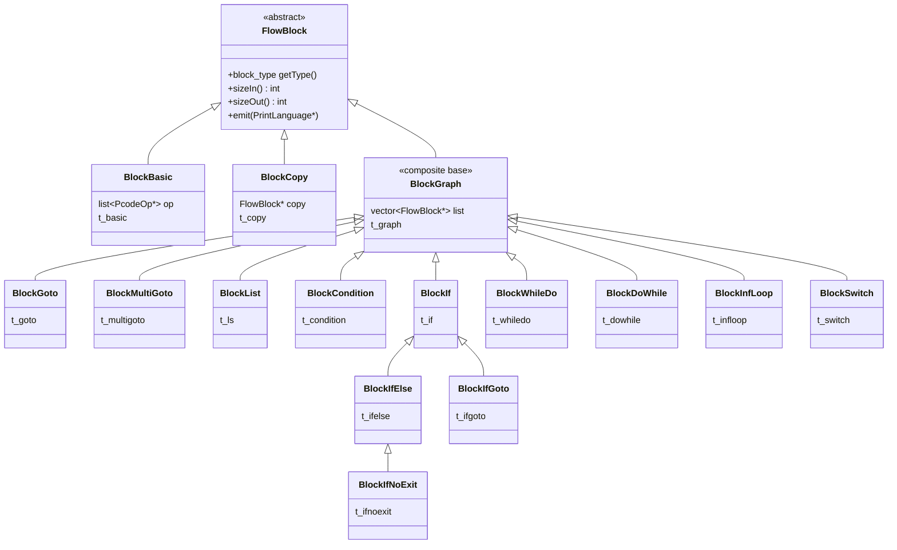

# Control-Flow Structuring

> Produced by [`.tasks/0007`](../../.tasks/0007-task-review-control-flow-structuring.md), part of
> [`.tasks/0002`](../../.tasks/0002-epic-review-current-implementation.md). Related documents:
> [`00-index.md`](00-index.md) (end-to-end pipeline narrative),
> [`action-rule-engine.md`](action-rule-engine.md) (0006 — structuring is itself implemented as a
> family of `Action`s scheduled by the same engine). Shared terms: [`glossary.md`](../00-overview/glossary.md).

## What this covers

Once the `Action`/`Rule` engine (see 0006) has finished simplifying a function's P-code and data-flow,
the decompiler still only has a raw control-flow graph (CFG) of `BlockBasic` nodes — the same graph a
disassembler would produce. Producing readable C requires imposing a *hierarchy* of `if`/`else`,
`while`/`do`/`for`, `switch`, and (as a last resort) `goto` onto that graph. This is a classically hard
problem in decompilation: real-world CFGs, especially post-optimizer, are not always *reducible* (a
term defined below), and even when they are, more than one legal structuring can exist.

This document covers three source files under
`Ghidra/Features/Decompiler/src/decompile/cpp/`:

- **`block.hh` / `block.cc`** — the `FlowBlock`/`BlockGraph` class hierarchy: the data structure that
  *represents* structured code once it has been built.
- **`blockaction.hh` / `blockaction.cc`** — the `CollapseStructure` algorithm and its supporting
  `LoopBody`/`TraceDAG` machinery: the algorithm that *builds* the hierarchy, plus the `Action` classes
  (`ActionBlockStructure`, `ActionFinalStructure`, etc.) that invoke it as part of the pipeline.
- **`jumptable.hh` / `jumptable.cc`** — jump-table/switch recovery, a largely independent subsystem
  that runs *earlier* (during flow-following) and hands `BlockSwitch` structuring a pre-computed map of
  case labels to basic blocks.

## 1. The structuring algorithm, conceptually

### 1.1 Two-graph design: a permanent CFG and a disposable copy

The decompiler never mutates the function's real CFG (`Funcdata::bblocks`, of `BlockBasic` nodes) while
structuring it. Instead `ActionBlockStructure::apply` makes a full copy of it into a *second* graph,
`Funcdata::getStructure()`, whose leaves are `BlockCopy` wrappers around the original `BlockBasic`
nodes:

```cc
// blockaction.cc:2178
int4 ActionBlockStructure::apply(Funcdata &data)
{
  BlockGraph &graph(data.getStructure());
  if (graph.getSize() != 0) return 0;     // Check if already structured
  data.installSwitchDefaults();
  graph.buildCopy(data.getBasicBlocks());
  CollapseStructure collapse(graph);
  collapse.collapseAll();
  ...
}
```

`BlockCopy` (`block.hh:543`) documents this design directly:

> "The decompiler does control-flow structuring by making an initial copy of the control-flow graph,
> then iteratively collapsing nodes (in the copy) into *structured* nodes. So an instance of this class
> acts as the mirror of an original basic block within the copy of the graph. During the structuring
> process, an instance will start with an exact mirror of its underlying basic block's edges, but as
> the algorithm proceeds, edges may get replaced as neighboring basic blocks get collapsed, and
> eventually the instance will get collapsed itself and become a component of one of the *structured*
> block objects (BlockIf, BlockDoWhile, etc)." — `block.hh:536-542`

This is the central mechanism: **structuring is graph rewriting by repeated node collapse**. A
sub-graph matching some recognizable shape (e.g. "two blocks, A branches to B, B falls through to A's
other successor") is replaced, in place, by a single new node (a `BlockIf`) that owns the two originals
as children and inherits their remaining edges. The process repeats until the whole function has
collapsed to one node — the root `BlockGraph` returned by `Funcdata::getStructure()`.

`blockaction.hh:183-191` states the algorithm in three lines:

> "In short:
>    - Start with a control-flow graph of basic blocks.
>    - Repeatedly apply:
>       - Search for sub-graphs matching specific code structure elements.
>       - Note the structure element and collapse the component nodes to a single node.
>    - If the process gets stuck, remove appropriate edges, marking them as unstructured."

### 1.2 The rule catalog (`CollapseStructure`)

`CollapseStructure` (`blockaction.hh:192`, implementation `blockaction.cc:1052-1901`) is a fixed
catalog of *shape-matching rules*, each a `bool ruleBlockX(FlowBlock *bl)` method that tests whether
`bl` (plus its immediate neighbors) matches one recognizable pattern, and if so calls the matching
`BlockGraph::newBlockX(...)` factory to perform the collapse:

| Rule (`blockaction.cc`) | Structure produced | Shape tested |
|---|---|---|
| `ruleBlockGoto` (`:1450`) | `BlockGoto` / `BlockIfGoto` / `BlockMultiGoto` | An out-edge is already marked unstructured (`f_goto_edge`) |
| `ruleBlockCat` (`:1284`) | `BlockList` | A straight-line chain of blocks that only fall through to each other |
| `ruleBlockOr` (`:1321`) | `BlockCondition` | Two binary-condition blocks that both flow to the same two exits — an `&&`/`\|\|` expression (duality: OR is detected, AND falls out as its negation) |
| `ruleBlockProperIf` (`:1378`) | `BlockIf` (no else) | One arm of a binary condition is a single-entry/single-exit clause that rejoins the other arm's target |
| `ruleBlockIfElse` (`:1416`) | `BlockIfElse` | Both arms are single-entry/single-exit clauses that rejoin at a common block |
| `ruleBlockIfNoExit` (`:1481`) | `BlockIfNoExit` / `BlockIf` | One or both clause blocks have **no** outgoing edge (they end in `return`, `throw`-like halts, or infinite loops) |
| `ruleBlockWhileDo` (`:1526`) | `BlockWhileDo` | A binary-condition block where one arm is a single-entry/single-exit block looping back to the condition |
| `ruleBlockDoWhile` (`:1563`) | `BlockDoWhile` | A binary-condition block where one out-edge loops back to itself |
| `ruleBlockInfLoop` (`:1587`) | `BlockInfLoop` | A block with exactly one out-edge, to itself |
| `ruleBlockSwitch` (`:1657`) | `BlockSwitch` | A block flagged `f_switch_out` (i.e. backed by a `JumpTable`), plus a search for a common exit block among its many out-edges |
| `ruleCaseFallthru` (`:1737`) | (marks a goto edge) | A switch case that falls through into another case body rather than to the switch's formal exit |

The driver loop, `collapseInternal` (`blockaction.cc:1776-1859`), tries these rules **in a fixed
priority order** against every remaining node, restarting the scan whenever any rule fires, until a
full pass makes no more progress:

```cc
// blockaction.cc:1789-1841 (abbreviated)
while (index < graph.getSize()) {
  bl = graph.getBlock(index);
  if (ruleBlockGoto(bl))     { change = true; continue; }
  if (ruleBlockCat(bl))      { change = true; continue; }
  if (ruleBlockProperIf(bl)) { change = true; continue; }
  if (ruleBlockIfElse(bl))   { change = true; continue; }
  if (ruleBlockWhileDo(bl))  { change = true; continue; }
  if (ruleBlockDoWhile(bl))  { change = true; continue; }
  if (ruleBlockInfLoop(bl))  { change = true; continue; }
  if (ruleBlockSwitch(bl))   { change = true; continue; }
}
```

`ruleBlockIfNoExit` and `ruleCaseFallthru` are deliberately tried only once the fixed-point loop above
is fully exhausted (`blockaction.cc:1843-1856`), because — per the comment at `blockaction.cc:1843-1844`
— *"Applying IfNoExit rule too early can cause other (preferable) rules to miss. Only apply the rule if
nothing else can apply."* This ordering constraint is the clearest evidence that the rule catalog is
**not** confluent: the order rules are tried in materially affects which (legal) structuring is chosen,
so more specific/greedy patterns are given first refusal.

`CollapseStructure::collapseAll` (`blockaction.cc:1885-1901`) is the outer driver:

```cc
void CollapseStructure::collapseAll(void)
{
  finaltrace = false;
  graph.clearVisitCount();
  orderLoopBodies();          // find & rank all loops via back-edges (Tarjan)
  collapseConditions();       // pre-pass: fold && / || (ruleBlockOr) to a fixed point
  isolated_count = collapseInternal((FlowBlock *)0);
  while (isolated_count < graph.getSize()) {
    FlowBlock *targetbl = selectGoto();   // <-- the "got stuck" fallback (see §3)
    isolated_count = collapseInternal(targetbl);
  }
}
```

Note `ruleBlockOr` (the `&&`/`||` fold) is *not* in the main `collapseInternal` loop's rule list — it
is deliberately commented out there (`blockaction.cc:1837-1840`) and instead run separately to a fixed
point via `collapseConditions()` before the main loop starts, and is not retried inside the main loop
at all. This means condition-merging is a strictly up-front pass, not interleaved with the other
collapses.

### 1.3 Theoretical basis: loops via Tarjan intervals, DAG structuring via path tracing

This is not a single unified "interval analysis" in the classic Allen/Cocke sense; the implementation
splits the problem into two, applied in that order at the top of `collapseAll`:

1. **Loops are found structurally, via dominance and back-edges** (a Tarjan-style approach), *before*
   any collapsing starts. `BlockGraph::structureLoops` (`block.cc:2212`) computes a spanning tree
   (`findSpanningTree`, `block.cc:1022`, explicitly "*Algorithm originally due to Tarjan*",
   `block.cc:1018`) and irreducible edges (`findIrreducible`, `block.cc:1160`, also "*Original
   algorithm due to Tarjan*", `block.cc:1156`). `CollapseStructure::labelLoops` (`blockaction.cc:1126`)
   then walks every back-edge to build one `LoopBody` (`blockaction.hh:46`) per loop head, and
   `orderLoopBodies` (`blockaction.cc:1148`) nests them (innermost loops processed first — `loopbody`
   is explicitly sorted "based on nesting depth (deepest come first)", `blockaction.cc:1175`).
2. **Everything else (the acyclic remainder once loop back-edges are set aside) is structured by local
   pattern matching** — the `ruleBlockX` catalog above — which is really a bottom-up recognition of the
   textbook "single entry / single exit region" shapes (sequence, if, if-else, no-exit-if) that compose
   into a DAG's series-parallel structure. The `TraceDAG` class (`blockaction.hh:96`) is the piece
   doing the actual interval-like reasoning: it explores the sub-graph as a tree of `BranchPoint`s and
   `BlockTrace`s, retiring a branch only once every path out of it rejoins at a single node:

   > "With the exception of the back edges in loops, structured code tends to form a DAG. Within the
   > DAG, all building blocks of structured code have a single node entry point and (at most) one exit
   > block. Given root points, this class traces edges with this kind of structure. Paths can
   > recursively split at any point, starting a new *active* BranchPoint, but the BranchPoint can't be
   > *retired* until all paths emanating from its start either terminate or come back together at the
   > same FlowBlock node." — `blockaction.hh:80-87`

   `TraceDAG` does not itself perform collapses — its output, per node not retired, is the *likely
   goto* list consumed when `CollapseStructure` gets stuck (§3).

## 2. `FlowBlock` hierarchy

All structured/unstructured block kinds derive from the abstract `FlowBlock` (`block.hh:76`), which
owns the block's in/out edge lists and dominance info. `BlockGraph` (`block.hh:380`) is the concrete
base for every *composite* node — it owns an ordered `vector<FlowBlock *> list` of components and is
itself the class instantiated (with different runtime `block_type`) for every structure the algorithm
recognizes. `BlockBasic` (`block.hh:479`) and `BlockCopy` (`block.hh:543`) are the two leaf kinds.



What each subtype means in generated C (source: doc comments on each class in `block.hh`, plus
`emit()`/`printHeader()` overrides in `block.cc`):

| Class | `block_type` | `block.hh` | Emitted as |
|---|---|---|---|
| `BlockBasic` | `t_basic` | `:479` | A straight run of statements with no internal branches — the actual `PcodeOp`s live here |
| `BlockCopy` | `t_copy` | `:543` | Structuring-internal only; transparently delegates to the `BlockBasic`/structured block it mirrors — never itself visible in output |
| `BlockList` | `t_ls` | `:624` | A sequence of statements/blocks executed one after another (no braces of its own) |
| `BlockCondition` | `t_condition` | `:645` | A merged `&&`/`\|\|` boolean expression combining two conditional blocks (see rule `ruleBlockOr`) |
| `BlockIf` | `t_if` | `:678` | `if (cond) { body }` — 1–3 components: condition, optional true-body, optional false-body |
| `BlockIfElse` | `t_ifelse` | `:691` | `if (cond) { } else { }` — both arms present and each has an exit |
| `BlockIfNoExit` | `t_ifnoexit` | `:704` | `if (cond) { bodyA } bodyB` printed *without* an `else` — both `bodyA`/`bodyB` never fall through (each ends in return/throw/infinite loop), so C's natural fallthrough-avoidance means no `else` keyword is needed |
| `BlockIfGoto` | `t_ifgoto` | `:718` | `if (cond) goto label;` — one arm is unstructured |
| `BlockGoto` | `t_goto` | `:571` | A single formal `goto label;` (or, per `gotoPrints()`, sometimes *not* printed at all if the target is the next block anyway — `block.cc:2943-2952`) |
| `BlockMultiGoto` | `t_multigoto` | `:597` | Wraps a `BlockBasic`/switch block that has one or more additional unstructured branches beyond its structured ones (e.g. some switch cases jump out via `goto`) |
| `BlockWhileDo` | `t_whiledo` | `:749` | `while (cond) { body }`, or `for(init; cond; iter) { body }` if the "for-loop" final transform (`finalTransform`, `block.cc:3477`) identifies a loop variable, initializer and iterator statement |
| `BlockDoWhile` | `t_dowhile` | `:777` | `do { body } while (cond);` — condition checked at the loop bottom |
| `BlockInfLoop` | `t_infloop` | `:791` | `while(true) { body }` (or `for(;;)`) — no structured exit at all |
| `BlockSwitch` | `t_switch` | `:808` | `switch (var) { case ...: ... }` — first component is the dispatch block, remaining components are `case` bodies, driven by a `JumpTable*` (§4) |

Two boolean-property enums on `FlowBlock` (`block.hh:80-124`) carry the bookkeeping the algorithm needs
across the whole run: `block_flags` (per-node — `f_goto_goto`, `f_entry_point`, `f_switch_out`, ...) and
`edge_flags` (per-edge — `f_back_edge`, `f_loop_edge`, `f_irreducible`, `f_goto_edge`,
`f_defaultswitch_edge`, ...). Several `FlowBlock` predicates exist purely to hide these flag
combinations from the rules, e.g. `isDecisionOut` (`block.hh:348`) — *"Can this and the i-th output be
merged into a BlockIf or BlockList"* — which is `true` only when the edge is none of irreducible,
back-edge, or already-goto.

## 3. Irreducible CFGs and the goto fallback

### 3.1 Reducibility and irreducible edges

A CFG is **reducible** if every loop has a single entry point reachable only through its header (no
edges jump directly into the "middle" of a loop from outside). Compiler-generated code is
overwhelmingly reducible, but hand-written `goto`-based state machines, some switch-based dispatch
loops, and some optimizer transforms (loop unswitching, jump threading) can produce genuinely
irreducible graphs.

`BlockGraph::findSpanningTree` (`block.cc:1022`) and `BlockGraph::findIrreducible` (`block.cc:1160`)
implement Tarjan's classical reducibility test together: a depth-first spanning tree is built, back
edges are detected, and `findIrreducible` collapses "reach-under" sets to find edges that would need to
be removed for the graph to become reducible; such an edge is flagged `f_irreducible`
(`block.cc:1191`). If a *tree* edge turns out to be irreducible, the spanning tree must be rebuilt
(`needrebuild`, `block.cc:1192-1193`) ignoring it, which `BlockGraph::structureLoops`
(`block.cc:2212-2228`) loops on until stable. Irreducible edges are, from that point on, treated
exactly like a `goto`: `isDecisionOut`/`isDecisionIn`/`isGotoOut`/`isGotoIn` (`block.hh:348-359`) all
mask `f_irreducible` together with `f_back_edge` and `f_goto_edge`, so no `ruleBlockX` will ever try to
absorb that edge into a structured shape.

### 3.2 What "getting stuck" means, and how an edge is chosen

`CollapseStructure::collapseAll` runs `collapseInternal` (the full rule-matching fixed point) and then
checks whether the graph is fully collapsed to a single isolated node. If not — every rule failed to
fire anywhere, but more than one node remains — it calls `selectGoto()` (`blockaction.cc:1260-1277`) to
mark exactly **one** additional edge as unstructured, then resumes `collapseInternal` from that point
(`blockaction.cc:1896-1900`). This is the literal goto-fallback trigger condition: *the rule catalog in
§1.2 made no further progress on a full pass over the current innermost loop body (or, once no loops
remain, over the final DAG)*.

`selectGoto` does not choose arbitrarily. It draws from a **pre-computed ranked list** of "likely goto"
edges built by `TraceDAG` for whichever loop body (innermost-first) or final DAG is currently active
(`updateLoopBody`, `blockaction.cc:1193-1253`). Within `TraceDAG::pushBranches` /
`TraceDAG::selectBadEdge` (`blockaction.cc:730`, driven by the `BadEdgeScore` comparator
`blockaction.hh:143-154`), edges that are still "active" once tracing can push no further are scored
and sorted so the *least structurally damaging* edge — e.g. one whose removal is least likely to also
have been a natural loop exit or a shared-sibling edge — is preferred. Only after this ranked list is
exhausted does `CollapseStructure` fall back to `clipExtraRoots()` (`blockaction.cc:1108`), which
handles the specific case of multiple disjoint unreachable-from-each-other root components (e.g. dead
code islands) by cutting their cross edges; if even that finds nothing to cut, the algorithm gives up
outright:

```cc
// blockaction.cc:1274-1276
if (!clipExtraRoots())
  throw LowlevelError("Could not finish collapsing block structure");
```

This `LowlevelError` is the decompiler's genuine "structuring is impossible" case — in practice it
should be unreachable given the fallback layers above, and its presence in the source is effectively an
assertion that the algorithm believes it always has *some* legal edge to cut.

### 3.3 Turning a goto edge into `break`/`continue`/`goto`

Marking an edge unstructured (`FlowBlock::setGotoBranch`, `block.hh:294`) only removes it from further
consideration by the collapse rules; `ruleBlockGoto` (`blockaction.cc:1450`) is what actually wraps the
now-orphaned edge in a `BlockGoto`/`BlockIfGoto`/`BlockMultiGoto` node. What *kind* of jump prints —
`goto label;`, `break;`, or `continue;` — is decided much later, in the `scopeBreak` pass
(`ActionFinalStructure::apply`, `blockaction.cc:2195-2206`, calling `BlockGraph::scopeBreak`,
`block.cc:1284`): as the final hierarchy is walked top-down, each nested block is told its current
"exit" and "loop exit" target indices, and any `BlockGoto` whose target coincides with the loop's exit
is reclassified as a `break` (see `BlockGoto::scopeBreak`, `block.cc:2928-2936`: *"Check if our goto
hits the current loop exit ... If so, our goto is a break"*). A `goto` that turns out to target the very
next block to be printed is suppressed entirely — `BlockGoto::gotoPrints()` (`block.cc:2943-2952`)
documents this as a *"rare"* emitter accident: *"Under rare circumstances, the emitter can place the
target block of the goto immediately after this goto block ... there should not be a formal goto
statement emitted."*

## 4. Jump-table / switch recovery

Switch recovery is architecturally separate from block structuring: it runs *during flow-following*
(well before `ActionBlockStructure`), driven by `JumpTable` (`jumptable.hh:542`) objects attached to
each `CPUI_BRANCHIND` op. By the time `ruleBlockSwitch` (`blockaction.cc:1657`) runs, the relevant
`BlockBasic` is already flagged `f_switch_out` and its `JumpTable*` is retrievable via
`FlowBlock::getJumptable()` (`block.hh:360`) — structuring only needs to find the shared *exit* block
among the switch's many successors and collapse everything into a `BlockSwitch`.

### 4.1 From an indirect branch to a case-label table

The `JumpModel` hierarchy (`jumptable.hh:243`) abstracts *how* a compiler computed the indirect branch
target; `JumpTable` picks and drives whichever model recovers successfully:

- **`JumpBasic`** (`jumptable.hh:374`) — the common case: *"A straight-line calculation from switch
  variable to BRANCHIND ... bounded by one or more guards that branch around the BRANCHIND"*
  (`jumptable.hh:370-373`, restated as the driving comment at `JumpBasic::recoverModel`,
  `jumptable.cc:1464-1467`). It walks backward from the `BRANCHIND`'s input Varnode
  (`findDeterminingVarnodes`) to find the smallest consistent *normalized* value range
  (`findNormalized`, `jumptable.cc:1249`), using any `CBRANCH`es that gate reachability of the indirect
  branch as range-restricting **guards** (`GuardRecord`, `jumptable.hh:138`) — this is the standard
  `if (x < N) goto *table[x];` bounds-check pattern.
- **`JumpBasic2`** (`jumptable.hh:442`) handles the common two-path variant where a separate `default:`
  value merges in outside the guarded range (documented case shapes at `jumptable.hh:434-437`).
- **`JumpAssisted`** (`jumptable.hh:511`) is used when SLEIGH's `jumpassist` pseudo-op annotations
  supply an explicit two-stage `case2index`/`index2address` recipe instead of the generic
  straight-line-calculation heuristic — used for architectures/compilers whose table encoding the
  generic model can't pattern-match.
- **`JumpBasicOverride`** (`jumptable.hh:462`) and **`JumpModelTrivial`** (`jumptable.hh:350`) are
  fallbacks: a manually-specified address list (user/script override), or simply trusting the CFG
  edges already recovered by flow-following when no model could be fit.

Once a model is recovered, `JumpTable::switchOver` (`jumptable.cc:2572`) maps each recovered absolute
address to the specific out-edge of the switch's dispatch block, and separately picks the single
**most duplicated** target out-edge to be the `default:` case (`jumptable.cc:2596-2612`: the out-edge
with the largest count of address-table entries mapping to it, on the reasoning that a default/no-match
path is the one target reachable by the largest number of distinct switch values that didn't get a
literal case). `Funcdata::installSwitchDefaults` (`funcdata_block.cc:706-718`) then stamps that edge
`f_defaultswitch_edge` on the *real* CFG immediately before `ActionBlockStructure` copies it
(`blockaction.cc:2185-2186`), so `checkSwitchSkips`/`isDefaultBranch` (`block.hh:332`,
`blockaction.cc:1615`) can tell a legitimate default fallthrough from a case that merely happens to
alias the exit block.

Case **labels** — the actual literal values printed after `case` — are a separate recovery step run
later, `JumpTable::recoverLabels` (`jumptable.cc:2758`): once the *unnormalized* switch variable is
identified (`JumpModel::findUnnormalized`), each address-table entry's originating normalized value is
walked back through the same arithmetic to the value the source-level switch expression would have held
(`JumpModel::buildLabels`). Multiple entries mapping to the same block become a chain of labels
(`ruleCaseFallthru` and `BlockSwitch::CaseOrder`, `block.hh:810-822`) or, when a block is reached by a
long run of consecutive case bodies without a break (fallthrough), the second/third/... labels in that
chain are recorded via the `depth`/`chain` bookkeeping in `CaseOrder` and printed on the fallen-through
block rather than duplicating code (`block.cc:3680-3714`).

### 4.2 Relationship to the type system (enum recovery)

The dispatch variable's *declared* datatype governs how `case` values print. `BlockSwitch::getSwitchType`
(`block.cc:3719-3724`) fetches the `Datatype` bound to the `BRANCHIND`'s input Varnode
(`getHighTypeReadFacing`); `PrintC::emitSwitchCase` (`printc.cc:3264-3296`) then calls the ordinary
constant-printing path (`pushConstant`, using that same `Datatype` and any per-table
`getDisplayFormat()` override, `printc.cc:3283-3291`). This is exactly the same path that prints any
other constant of enum type — so if the type system (see `type-system.md`, 0005) has bound the switch
variable to a `TypeEnum` (recovered from a Ghidra enum datatype attached to the variable, or inferred),
`case` values print as enumerator names automatically; there is no switch-specific enum-recovery logic
in `jumptable.cc`/`block.cc` — jump-table recovery only produces `(value, target-block)` pairs, and
labeling them with symbolic names is entirely downstream of ordinary type propagation and `PrintC`
constant formatting.

### 4.3 Multistage recovery and thunks

Jump tables aren't always fully resolvable on the first pass — some compilers compute the table address
itself through a level of indirection that isn't known until *more* flow has been followed.
`JumpTable::checkForMultistage` (`jumptable.cc:2896-2909`) detects the specific symptom (table currently
has exactly one recovered address, and an override database entry says this site is known to be
multistage) and requests `Funcdata::setRestartPending` so flow-following restarts with more context;
`JumpTable::recoverMultistage` (`jumptable.cc:2697-2720`) is the retry entry point, which preserves the
old (single-address) model and restores it if the retry throws. `JumpTable::sanityCheck`
(`jumptable.cc:2360-2378`) also actively distinguishes a genuine switch from a **thunk** — a function
that is nothing but a tail-indirect-jump — via `isThunk` (`jumptable.cc:2336-2350`: a single-address
table whose target is literally the null address, or a function body containing nothing but
`BRANCH`/`BRANCHIND`), throwing `JumptableThunkError` (`jumptable.hh:42`) rather than treating a thunk's
single jump as a degenerate one-case switch.

## 5. Known hard cases (from source comments)

- **Fixed rule-priority order matters.** `ruleBlockIfNoExit` and `ruleCaseFallthru` are deliberately
  held back until nothing else in the catalog can fire (`blockaction.cc:1843-1856`), because applying
  the "body never exits" `if` shape early can pre-empt a more natural `if`/`if-else` match elsewhere in
  the same region. `ruleBlockOr` (the `&&`/`\|\|` merge) is similarly kept out of the main loop
  entirely and run only as an isolated, up-front fixed point (commented out at
  `blockaction.cc:1837-1840`, actually driven by `collapseConditions`, `blockaction.cc:1862-1873`) —
  the surviving comment at `blockaction.cc:1343-1344` even notes *"This line was always commented
  out. I assume minor block order variations were screwing up this rule."*, i.e. a known but
  unresolved fragility in that rule's interaction with the rest of the catalog.
- **Overflow syntax for oversized loop conditions.** A `while`/`do` condition block can itself be too
  structurally complex to print as a single C boolean expression (`FlowBlock::isComplex`,
  `block.hh:259`). `ruleBlockWhileDo` (`blockaction.cc:1546-1553`) detects this and sets
  `f_whiledo_overflow` so `PrintC` falls back to `while(true) { ...; if (!cond) break; ... }`-shaped
  output instead of a natural `while(cond)`; `BlockWhileDo::hasOverflowSyntax`/`setOverflowSyntax`
  (`block.hh:761-762`) and `finalTransform` (`block.cc:3482`, which explicitly bails out of *for-loop*
  recovery when overflow syntax is in play) both key off this flag.
- **Switch "skip" edges that alias the exit block.** `checkSwitchSkips` (`blockaction.cc:1603-1652`)
  documents a specific ambiguity: some jump tables have edges that go straight to the switch's exit
  block *for reasons other than being the formal default* (i.e., some case explicitly targets the
  fallthrough point). If a *different* edge is also the true default and that default does **not**
  itself go to the exit, `ruleBlockSwitch` cannot yet resolve the switch structurally — those aliasing
  edges are peeled off as `goto`s first so the default/exit ambiguity is unambiguous by the time the
  switch collapses.
- **Guard conditions duplicated (unrolled) across multiple predecessor blocks.**
  `JumpBasic::checkUnrolledGuard` (`jumptable.cc:1372-1414`) exists because optimizers sometimes
  duplicate a switch's range-guard `CBRANCH` across several blocks that all merge into the dispatch
  block (rather than one common guard block) — the doc comment calls this out explicitly: *"A guard
  calculation can be duplicated across multiple blocks that all branch to the basic block performing
  the final BRANCHIND. In this case, the switch variable is also duplicated across multiple Varnodes
  that are all inputs to a MULTIEQUAL..."* (`jumptable.cc:1372-1377`). The companion `GuardRecord`
  field `unrolled` (`jumptable.hh:146`) marks these so `markFoldableGuards` (`jumptable.cc:1282-1294`)
  knows not to try folding them the same way as an ordinary single-block guard.
- **Single-byte switch variables are deliberately distrusted.** `JumpBasic::findNormalized`
  (`jumptable.cc:1231-1237`) refuses to accept a 1-byte switch variable spanning the full 256-value
  range unless there is an explicit guard or a table LOAD between the byte and the indirect jump — the
  comment gives the concrete failure mode being guarded against: *"`goto *(#const + byteVar)` should
  not be interpreted as 256 case switch"* (`jumptable.cc:1234`), i.e. without this check a
  hand-rolled computed-goto over a byte-sized offset would misfire the switch-recovery heuristics into
  synthesizing a spurious 256-case `switch`.
- **Read-only jump tables with a single branch are held to a stricter standard.**
  `findNormalized` (`jumptable.cc:1257-1275`) also special-cases when the normalized-value range check
  fails but there is only one common Varnode in the path: it will only trust the table's contents (via
  a direct `MemoryImage` read) as an override *if* the memory backing it is actually read-only,
  because — as the comment explains — *"jumptable construction almost always implies that the entries
  are readonly even if they aren't labelled properly. The exception is if the jumptable has only one
  branch as it very common to have semi-dynamic vectors that are set up by the system. But the original
  LoadImage values are likely incorrect."* (`jumptable.cc:1259-1266`) — a direct acknowledgment that
  the loader's static image can be stale for tables the running program rewrites at startup.
- **Duplicated ("split") conditional expressions across merging blocks.** `ConditionalJoin`
  (`blockaction.hh:234-265`) is a pre-structuring cleanup pass (not part of `CollapseStructure` itself)
  for a distinct optimizer artifact: *"a conditional expression, resulting in a CBRANCH, is duplicated
  across two blocks that would otherwise merge. Instead of a single conditional in a merged block, there
  are two copies of the conditional, two splitting blocks and no direct merge."* (`blockaction.hh:230-233`).
  Left unhandled, this pattern (typical after loop unswitching or jump-threading) would present the
  structuring algorithm with a CFG shape none of the `ruleBlockX` patterns recognize, so it is detected
  and the two duplicate blocks are explicitly rejoined (`ConditionalJoin::match`/`execute`,
  `blockaction.cc:2073-2116`) before `CollapseStructure` ever runs.
- **Thunks vs. degenerate one-entry switches.** As noted in §4.3, a function that is nothing but an
  indirect tail jump can otherwise look to the jump-table recovery machinery exactly like a
  legitimately-recovered one-entry switch; `JumpTable::isThunk`/`sanityCheck`
  (`jumptable.cc:2336-2378`) exists specifically to head that misclassification off with a dedicated
  exception type (`JumptableThunkError`, `jumptable.hh:42-44`).
- **Multi-stage (indirect-of-indirect) table computation.** Covered in §4.3 — `checkForMultistage`
  (`jumptable.cc:2896-2909`) and `recoverMultistage` (`jumptable.cc:2697-2720`) exist because some
  compilers compute a jump table's base address itself through a level of indirection not resolvable
  until a second flow-following pass has more context, and the source treats this as expected enough
  to warrant a dedicated restart mechanism (`Funcdata::setRestartPending`) rather than simply failing
  recovery.
- **Irreducible-CFG detection is a Tarjan reachunder collapse, and needs iteration to converge.**
  `structureLoops` (`block.cc:2212-2228`) loops `findSpanningTree`/`findIrreducible` until
  `needrebuild` goes false, because marking a *tree* edge irreducible invalidates the very spanning
  tree `findIrreducible` used to find it (`block.cc:1192-1193`) — a self-referential fixed point the
  code comments do not shy away from calling out directly in `findIrreducible`'s doc comment
  (*"Return true if the spanning tree needs to be rebuilt, because one of the tree edges is
  irreducible"*, `block.cc:1155`).
- **`calcLoop` is an explicit failsafe, not the primary loop-detection path.** `BlockGraph::calcLoop`
  (`block.cc:2122-2165`) is a simpler DFS-based cycle breaker kept in the source purely as a backstop:
  its doc comment states *"This is now only applied as a failsafe if the graph has irreducible
  edges"* (`block.cc:2121`), and the one branch where it would find a *new* cycle the primary
  reducibility algorithm didn't already account for carries the comment *"Technically we should never
  reach here if the reducibility algorithms work"* (`block.cc:2152`) — i.e. the source itself flags
  this as a defensive path against a bug in the primary algorithm rather than a case expected to
  trigger in practice.

## Notes for the flaws pass (0011/0013)

Not acted on here (out of scope for a review document), but worth flagging for
[`02-flaws/rule-engine-block-structuring.md`](../02-flaws/rule-engine-block-structuring.md) (0013):
the rule catalog's reliance on a fixed try-order with at least one documented "screwed up by minor
block order variations" fragility (`blockaction.cc:1343-1344`) and a separate documented ordering
constraint for `ruleBlockIfNoExit`/`ruleCaseFallthru` (`blockaction.cc:1843-1844`) both suggest the
current structuring algorithm is sensitive to incidental node/edge enumeration order in ways that are
not obviously by design.
