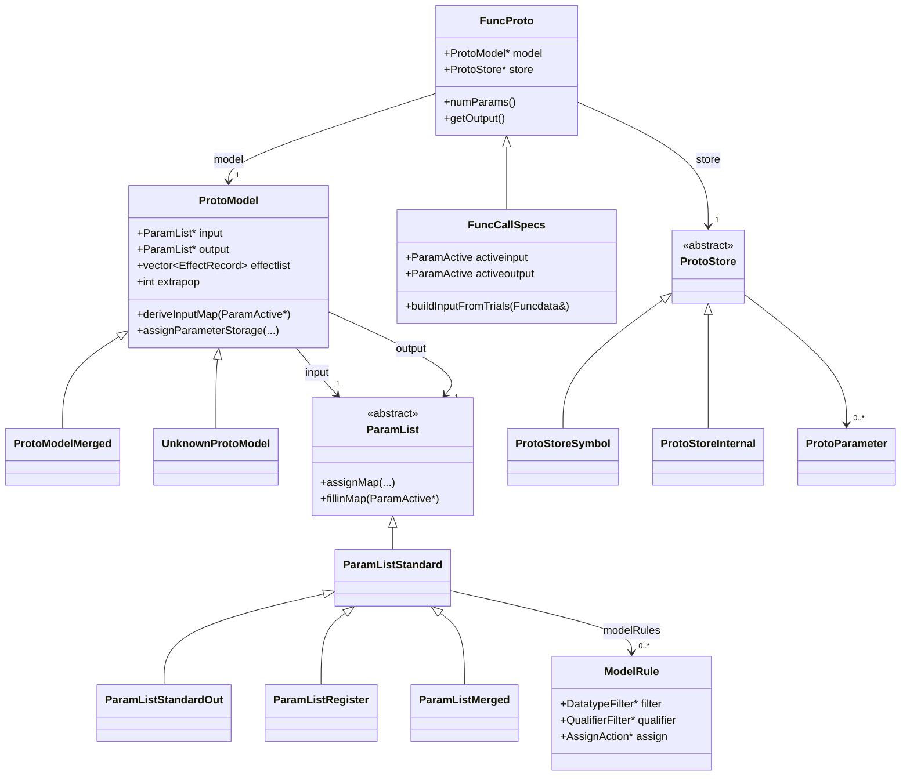

<!-- Produced by .tasks/0008-task-review-signature-calling-conventions.md -->
# Function Signature & Calling-Convention Recovery

Ticket: [`.tasks/0008`](../../.tasks/0008-task-review-signature-calling-conventions.md), part of epic
[`.tasks/0002`](../../.tasks/0002-epic-review-current-implementation.md). See
[`00-index.md`](00-index.md) for how this fits into the end-to-end pipeline, and the shared
[glossary](../00-overview/glossary.md) for cross-cutting terms (`ProtoModel`/`FuncProto` is already
seeded there).

This document covers `Ghidra/Features/Decompiler/src/decompile/cpp/fspec.{hh,cc}` (the
`ProtoModel`/`FuncProto`/`FuncCallSpecs` machinery), `modelrules.{hh,cc}` (the declarative
storage-assignment rule engine), `paramid.{hh,cc}` (a secondary, heuristic parameter-confidence
scorer), `override.{hh,cc}` (the trust boundary between recovered and asserted signatures), and
`userop.{hh,cc}` (CALLOTHER descriptions, relevant where calling-convention behavior is injected as
p-code). It also uses `Ghidra/Features/Decompiler/src/main/doc/cspec.xml` — the human-facing DocBook
reference for the `.cspec` XML format — to explain where `ProtoModel` data originates.

## 1. The two-layer model: `ProtoModel` vs. `FuncProto`

Ghidra separates a **static, architecture/compiler-wide description of a calling convention**
(`ProtoModel`) from a **specific function's recovered or asserted prototype** (`FuncProto`). This
split is the central design fact of this subsystem.

- **`ProtoModel`** (`fspec.hh:750-1019`) models one calling convention — e.g. `__stdcall`,
  `__cdecl`, the SysV x86-64 ABI. It is built once per `Architecture` from a compiler specification
  (`.cspec`) file and is shared, read-only, across every function that uses that convention. It owns:
  - `input`/`output` — two `ParamList*` objects (`fspec.hh:755-756`) describing available storage
    resources for parameters and for the return value, respectively.
  - `effectlist` — `EffectRecord`s describing what a callee does to non-parameter storage
    (`unaffected`, `killedbycall`, `return_address`) (`fspec.hh:391-416,758`).
  - `extrapop`, `stackgrowsnegative`, `localrange`/`paramrange`, `hasThis`, `isConstruct`,
    `injectUponEntry`/`injectUponReturn` (`fspec.hh:754-768`).
  - A model can be an **alias** of another (`compatModel`, `fspec.hh:757,777-381`, copy constructor at
    `fspec.cc:2351`) — e.g. `__thiscall` is usually a copy of the default model with `hasThis` forced
    on (`fspec.cc:2378-2379`).
  - `ProtoModelMerged` (`fspec.hh:1079-1092`) is a union of several `ProtoModel`s used while the exact
    convention for a function is still ambiguous; `ScoreProtoModel` (`fspec.hh:1042-1066`,
    `fspec.cc:2708-2770`) scores a set of observed trials against each candidate model so
    `ProtoModelMerged::selectModel` (`fspec.cc:2868-2893`) can pick the best fit once real data-flow is
    available.
  - `UnknownProtoModel` (`fspec.hh:1027-1034`) is instantiated whenever a `.cspec`-referenced model
    name can't be resolved — it clones the default model's behavior but reports `isUnknown()==true`,
    so callers can still make progress with an unrecognized convention name embedded in debug info or
    an override.

- **`FuncProto`** (`fspec.hh:1345-1625`) is a specific function's prototype: a `model` pointer, a
  `ProtoStore *store` holding the actual `ProtoParameter`s (name/type/address/locks), per-function
  overrides of `effectlist`/`likelytrash`, `extrapop`, and flags (`dotdotdot`, `modellock`,
  `is_inline`, `custom_storage`, `is_constructor`, …, `fspec.hh:1346-1361`). Multiple `FuncProto`s
  (one per decompiled function, plus one per call site — see §2) can point at the same `ProtoModel`.
  `FuncProto` largely **delegates** to its `model` for anything that's part of the calling convention
  proper (`deriveInputMap`, `checkInputJoin`, `assumedInputExtension`, … all one-line forwarders,
  e.g. `fspec.hh:1496-1527,1587-1601`), and only owns what's specific to *this* function (the actual
  parameter list, locks, injection id, no-return/inline flags).

- **`FuncCallSpecs`** (`fspec.hh:1646-1743`) is a third layer: it *is-a* `FuncProto` (inherits) but
  additionally tracks the live analysis state for one CALL/CALLIND site — `ParamActive activeinput`/
  `activeoutput` (the working trial sets, §2), the stack-pointer placeholder mechanism for computing
  `extrapop` from data-flow, and the `Funcdata*` of the callee if resolved. A `FuncCallSpecs` is
  created for every call site (`FlowInfo::setupCallSpecs`/`setupCallindSpecs`, `flow.cc:695-730`) and
  is what call-site overrides and per-call parameter recovery actually operate on; the callee's own
  `Funcdata::getFuncProto()` is a separate, non-`FuncCallSpecs` `FuncProto`.



### 1.1 Data flow: from `.cspec` to a recovered `FuncProto`

1. **Load time.** `Architecture` parses the `.cspec` XML for the program's compiler. Each
   `<prototype>` element becomes one `ProtoModel`, decoded by `ProtoModel::decode`
   (`fspec.cc:2540-2606` onward): it reads `name`, `extrapop`, `strategy`, `hasthis`, `constructor`,
   then calls `buildParamList(strategy)` (`fspec.cc:2314-2327`) which instantiates either
   `ParamListStandard`+`ParamListStandardOut` (`strategy="standard"`, the default) or
   `ParamListRegister`+`ParamListRegisterOut` (`strategy="register"`, for loosely-conventioned
   hand-written assembly). It then decodes the nested `<input>`/`<output>` elements into `ParamEntry`
   lists (`ParamListStandard::decode` → `parseGroup`/`parsePentry`, `fspec.cc:1226-1284`) — each
   `<pentry>` becomes one `ParamEntry` (a register or stack-slot resource, `fspec.hh:84-155`) —
   and any `<model_rule>` children into `ModelRule`s (§1.2). The DocBook reference for this format
   is `cspec.xml:1245-1373` ("Parameter Passing" / "Describing Parameters and Allocation Strategies");
   the `<pentry>` table is at `cspec.xml:1615-1734`.
2. **Per function, at first encounter.** When the Java side hands the decompiler a function to
   decompile, or when analysis first walks a CALL instruction, a `FuncProto`/`FuncCallSpecs` is
   created and bound to a `ProtoModel` by name (`FuncProto::setModel`, `fspec.cc:3811`, or via
   `<prototype model="...">` on decode, `fspec.cc:4623-4631`). If the function already has a
   locked/typed signature in Ghidra's program database (the Java `FunctionSignature`), that arrives
   as marshaled XML and is decoded straight into `ProtoParameter`s via `ProtoStoreSymbol`/
   `ProtoStoreInternal::decode` (`fspec.cc:3292,3457`) — no trial-based recovery is needed for those.
   Otherwise the function starts with **zero parameters** and analysis discovers them from data-flow
   (§2).
3. **Storage assignment (forward direction: types known → addresses).** Whenever a full parameter
   type list is available (a locked prototype, a call to a symbol with a known signature, or a
   paramshift/override reconstruction), `ProtoModel::assignParameterStorage`
   (`fspec.cc:2420-2453`) drives `output->assignMap(...)` then `input->assignMap(...)`
   (`ParamListStandard::assignMap`, `fspec.cc:785-814`) to turn the ordered `Datatype*` list into
   concrete `Address`es, consulting `ModelRule`s first and a fixed fallback algorithm
   (`assignAddressFallback`, `fspec.cc:735-760`) second.
4. **Storage inference (reverse direction: observed addresses → parameters).** Whenever only raw
   data-flow is available (the normal case for a freshly disassembled function or an unresolved call
   target), `ParamList::fillinMap` (`ParamListStandard::fillinMap`, `fspec.cc:1285-1313`) is driven
   from `ProtoModel::deriveInputMap`/`deriveOutputMap` (`fspec.hh:793-801`) to turn a set of candidate
   `Varnode` trials into a formal parameter list. This is the "parameter-recovery pipeline" proper,
   detailed in §2.

### 1.2 `ModelRule`s: the declarative half of storage assignment

`modelrules.hh/.cc` implement a small rule engine that both `assignMap` (forward, §1.1 step 3) and
(for output only) `fillinMap` (reverse) consult before falling back to the hardcoded default
algorithm. Each `ModelRule` (`modelrules.hh:537-554`) is:

```
DatatypeFilter (which types this applies to) [+ QualifierFilter (extra conditions)] -> AssignAction
```

- **`DatatypeFilter`** (`modelrules.hh:95-166`) tests a `Datatype*` — `SizeRestrictedFilter` (bounds
  by byte size or an enumerated size set), `MetaTypeFilter` (matches one `type_metatype`, e.g.
  `TYPE_FLOAT`/`TYPE_STRUCT`), `HomogeneousAggregate` (all primitive members share one meta-type —
  the ARM/AAPCS64 "homogeneous floating-point aggregate" case).
- **`QualifierFilter`** (`modelrules.hh:172-256`) tests the broader prototype context: `VarargsFilter`
  (is this parameter before/after the first variadic slot — `firstVarArgSlot`), `PositionMatchFilter`,
  `DatatypeMatchFilter` (type at a *different*, fixed position — e.g. "only if parameter 0 is a
  particular tag type"), `AndFilter`.
- **`AssignAction`** (`modelrules.hh:262-323`) does the actual work and returns one of `success`,
  `fail`, `no_assignment`, or one of three hidden-return-pointer signals (§3.2). Concrete actions
  (`modelrules.hh:326-529`): `GotoStack`, `ConvertToPointer`, `MultiSlotAssign` (join several
  registers, e.g. a struct spanning 2 GPRs), `MultiMemberAssign` (one register per primitive member,
  no packing), `MultiSlotDualAssign` (mix general+float registers for one aggregate — the
  x86-64 SysV classification algorithm), `ConsumeAs` (force a specific resource class),
  `HiddenReturnAssign`, and three **side-effect-only** actions that consume resources without
  assigning an address themselves: `ConsumeExtra`, `ExtraStack`, `ConsumeRemaining`.
- **`PrimitiveExtractor`** (`modelrules.hh:58-89`) is the shared helper that flattens a composite
  type into its primitive members + offsets (used by `HomogeneousAggregate`,
  `MultiMemberAssign`, `MultiSlotDualAssign`) — this is where "does this struct decompose cleanly
  into N floats" / "does it contain a union" (`union_invalid`) gets decided.

`ParamListStandard::assignAddress` (`fspec.cc:772-783`) tries every `ModelRule` in declaration order
and only falls back to `assignAddressFallback` (the pre-`ModelRule`, hardcoded "first entry in the
resource list of the right type-class that isn't full yet" algorithm, `fspec.cc:721-760`) if none of
them apply. This means `ModelRule`s are **purely additive/overriding sugar** on top of a codepath that
still exists and is still exercised by every `.cspec` that doesn't define `<model_rule>`s (i.e. most
of them — the simple ABIs still just list ordered `<pentry>` resources). `ParamListStandardOut`
caches whether any of its rules can affect `fillinMap` at all (`useFillinFallback`,
`ParamListStandardOut::initialize`, `fspec.cc:1615-1628`) and, if not, reverts to the older
`fillinMapFallback` best-cover heuristic (`fspec.cc:1639-1720`) for the reverse direction — reverse
inference is **not** as fully rule-driven as forward assignment; only actions whose
`fillinOutputMap` is meaningfully overridden participate (`AssignAction::fillinOutputMap`'s default
is a no-op stub, `modelrules.hh:313`; overridden by `GotoStack`, `MultiSlotAssign`,
`MultiMemberAssign`, `MultiSlotDualAssign`, `ConsumeAs`).

**Notable:** `cspec.xml` (the shipped DocBook reference for the `.cspec` format) documents
`<prototype>`/`<pentry>`/strategy in detail (`cspec.xml:1245-1734`) but has **no section at all** for
`<model_rule>` or any of its sub-elements (`<datatype>`, `<consume>`, `<join>`, `<varargs>`,
`<hidden_return>`, `<multi_member>`, `<join_per_primitive>`, `<join_dual_class>`, `<extra_stack>`,
`<consume_remaining>` — all real, parsed elements per `modelrules.hh:39-52` and `modelrules.cc`'s
`decode` methods). This is a real user-facing documentation gap: `ModelRule`s are how every modern
multi-register-struct-passing ABI (x86-64 SysV, AArch64 AAPCS64) is actually specified in-tree, yet
the only reference is the C++ source and existing `.cspec` files that use them.

## 2. The parameter-recovery pipeline

This is the reverse-inference path (§1.1 step 4): turning the raw `Varnode`s touched at a call site
(or at function entry, for the function's own parameters) into a committed, ordered list of
`ProtoParameter`s.

### 2.1 Trials: `ParamTrial` / `ParamActive`

- **`ParamTrial`** (`fspec.hh:210-273`) is one putative parameter: an `Address`+size, a `slot`
  (position among the CALL's input `Varnode`s, or address order for a function's own inputs), a
  matched `ParamEntry*` once resolved, and a bitset of flags recording what's been learned about it
  so far: `checked`, `used`, `defnouse`, `active`, `unref`, `killedbycall`, `rem_formed`,
  `indcreate_formed`, `condexe_effect`, `ancestor_realistic`, `ancestor_solid`
  (`fspec.hh:212-224`). Trials start unclassified and accumulate flags as analysis passes run.
- **`ParamActive`** (`fspec.hh:285-337`) is the working container for one function's or one call
  site's input trials (or output trials — the same machinery is reused for both directions, tagged
  by `recoversubcall`). It tracks pass count vs. `maxpass` (heritage-delay-driven — some address
  spaces don't have data-flow available until N SSA passes have run,
  `ParamList::getMaxDelay`, `fspec.hh:557-563`), and whether trials still need a "final check" once
  more control-flow context (conditional-execution effects) is known
  (`needsfinalcheck`, `fspec.hh:292,303-304`).
- Per-site, `FuncCallSpecs` owns `activeinput`/`activeoutput` (`fspec.hh:1656-1657`) and drives the
  whole thing: `initActiveInput`/`initActiveOutput` turn analysis on; `checkInputTrialUse`/
  `checkOutputTrialUse` (`fspec.cc:5518,5594`) run each pass; `buildInputFromTrials`/
  `buildOutputFromTrials` (`fspec.cc:5618,5703`) commit the final decision back into the CALL op's
  actual `Varnode` inputs/output.

### 2.2 Classifying trials against the model: mapping and trimming

Given a `ProtoModel` (possibly still a `ProtoModelMerged`, resolved via `FuncProto::resolveModel`,
`fspec.cc:3760-3770`, which calls `ProtoModelMerged::selectModel`), `ParamListStandard::fillinMap`
(`fspec.cc:1285-1313`) runs this sequence every analysis pass:

1. **`buildTrialMap`** (`fspec.cc:849-937`) — for every trial, find the matching `ParamEntry` via the
   `ParamEntryResolver` range map (`findEntry`, backed by the `rangemap<ParamEntryRange>` populated
   at model-decode time, `populateResolver`, `fspec.cc:1191-1225`); trials with no matching entry are
   immediately marked `markNoUse()`. Any resource-list **group** that has no representative trial at
   all gets a synthetic `unref` trial inserted (`selectUnreferenceEntry`, `fspec.cc:820-841`) so gaps
   in the register-usage sequence are visible to the later "hole" logic rather than silently absent.
2. **`forceExclusionGroup`** (`fspec.cc:1032-1059`) — within a single-slot ("exclusion") resource
   group, at most one trial can really be active; if several are, `markBestInactive`
   (scored by `ancestor_realistic`/`ancestor_solid` and preferred type-class, `fspec.cc:997-1025`)
   picks the best and marks the rest `defnouse`.
3. **`separateSections`** (`fspec.cc:946-973`) splits the trial list at resource-list section
   boundaries (general-purpose vs. floating-point registers are scored independently) so the
   following two passes don't let one resource class's holes affect the other's.
4. **`forceNoUse`** (`fspec.cc:1069-1095`, per section) — this is the core **"trim spurious tail
   parameters"** heuristic: if an entire resource group is `defnouse`, every trial in every
   *subsequent* group in address/slot order is force-marked inactive too, on the theory that a real
   parameter list doesn't have a hole followed by more real parameters (the calling convention
   allocates left-to-right with no gaps).
5. **`forceInactiveChain`** (`fspec.cc:1111-1151`, per section, `maxchain=2`) — a softer version of
   the same idea for individual **inactive** (not-yet-decided, as opposed to definitely-not-used)
   trials: a chain of more than `maxchain` consecutive inactive slots is assumed genuinely unused and
   trims everything after it; a short chain (≤2) is instead assumed to be a real, simply
   under-referenced parameter and gets promoted to `active` to fill the hole. There's a special case
   for `isUnref()` trials with no direct `Varnode` reference at all: on the stack, a hole there can
   never legitimately be "reused caller-to-callee" register reuse (`fspec.cc:1120-1128`), so it's
   treated as stronger evidence of a real chain break than an unreferenced register would be.
6. Whatever survives with `isActive()` is finally `markUsed()` (`fspec.cc:1308-1312`) — this is the
   formal parameter list, still in resource/address order; `ParamTrial::operator<` then imposes final
   parameter order for commit (`fspec.cc:1894-1919`, with a fixed-position variant for varargs,
   `fixedPositionCompare`, `fspec.cc:1921-1948`, §3.1).

Before any of this, whether a trial is `active` at all is decided per-call by
`FuncCallSpecs::checkInputTrialUse` (`fspec.cc:5518-5586`): a stack trial is checked against local
aliasing and the caller's known `localRange`/callee-pop `extrapop`; a register trial is checked via
`AncestorRealistic` (a separate SSA-ancestor-walk utility, not part of this file's scope) — "is there
a plausible, non-degenerate definition reaching this call input" — combined with
`Funcdata::ancestorOpUse` to decide `markActive`/`markInactive`/`markNoUse`. Definitely-unused trials
have their CALL input immediately replaced with a zero constant (`fspec.cc:5583-5584`), which is what
ultimately produces the "here are only the real arguments" surface in printed C.

### 2.3 Committing trials

Once `fillinMap`'s verdict is final, `FuncCallSpecs::buildInputFromTrials`/`buildOutputFromTrials`
(`fspec.cc:5618,5703`) reorder and splice `Varnode`s into the CALL op's actual input/output list.
Multi-piece values (e.g. a 64-bit value split across two 32-bit registers/slots — the
"double-precision" case) are re-fused into one logical `Varnode` living at a synthetic **`join`**
address, built by `Architecture::constructJoinAddress`/`JoinRecord` (`fspec.cc:5755-5773`); only the
2-piece case is handled at commit time (`fspec.cc:5739-5779` — `activeoutput.getNumTrials()==2`), a
3+-piece output silently commits nothing (`fspec.cc:5780-5781`). The same join mechanism is what
`ParameterPieces::assignAddressFromPieces` (`fspec.cc:2192-2208`, used from `ModelRule` actions like
`MultiSlotAssign`) uses on the *forward* (type→storage) side for a struct parameter that spans
multiple registers — `JoinRecord::mergeSequence` + `Architecture::findAddJoin` create the same kind
of composite address from the forward direction.

For a **locked** prototype (`FuncProto::isInputLocked`, backed by a real Ghidra `FunctionSignature`
or an override, §4), `commitNewInputs` (`fspec.cc:5083-5123`) skips trial analysis for the fixed part
entirely and directly builds each parameter's storage from `getParam(i)->getAddress()` — the
`ParamActive` machinery is only still used to keep discovering *variadic* trailing arguments
(`fspec.cc:5117-5122`, §3.1).

## 3. Varargs, struct return, and multi-value return

### 3.1 Varargs (`...`)

Variable arguments are represented as `PrototypePieces::firstVarArgSlot`
(`fspec.hh:377-384`) / `FuncProto::isDotdotdot()` (`fspec.hh:1543-1544`, backed by the `dotdotdot`
flag and the `<prototype dotdotdot="...">` attribute, `ATTRIB_DOTDOTDOT`, `fspec.hh:31`). A prototype
is varargs if `firstVarArgSlot >= 0` when set (`fspec.cc:3752,4134`). Detection/handling touches
several places:
- **`ModelRule` filtering** — `VarargsFilter` (`modelrules.hh:220-229`) lets a `.cspec` express rules
  that apply only to the *optional* tail (e.g. "after the first vararg, only consume the general
  registers, never floating-point ones," the standard C ABI rule for `printf`-style functions on
  x86-64 SysV where vararg floats must also be counted in `%al`).
  `AssignAction::justifyPieces`/side-effect actions like `ConsumeExtra` are how that's expressed
  declaratively rather than as a hardcoded special case.
- **`resolveExtraPop`** (`fspec.cc:3964-3985`) special-cases varargs: extrapop can only be resolved
  from a locked prototype if there's at least one *fixed* (non-vararg) parameter — a pure `(...)`
  function like the `FARPROC` idiom can't have `__cdecl` vs. `__stdcall` disambiguated this way at
  all and is explicitly left `extrapop_unknown`.
- **Ongoing recovery for the tail** — as noted in §2.3, `commitNewInputs` keeps the `ParamActive`
  machinery alive after committing the locked, fixed part specifically so additional trailing
  register/stack trials keep being discovered call-site by call-site
  (`isDotdotdot()` check, `fspec.cc:5117-5122`). Each discovered variadic trial's original CALL-input
  position is preserved via `ParamTrial::fixedPosition`/`setFixedPosition`
  (`fspec.hh:232,271-272`) and `ParamActive::sortFixedPosition` — variadic arguments, unlike fixed
  ones, are ordered by where they were actually found at each call site rather than re-derived from
  the model's canonical parameter order.
- **`paramShift`** (`fspec.cc:3699-3753`) is the mechanism behind call-fixups/typedefs that prepend N
  synthetic leading parameters (used e.g. for injected "hidden first argument" ABIs); if the
  original prototype wasn't locked, the shift itself sets `firstVarArgSlot = paramshift`
  (`fspec.cc:3730`), which is how a paramshift can retroactively make a prototype look variadic.

### 3.2 Struct/large-value return and the hidden-pointer convention

`ParamListStandardOut::assignMap` (`fspec.cc:1570-1613`) is where a return value that can't fit
in the normal return-storage resource list gets converted:
1. Try the normal `assignAddress` path for the return type (goes through `ModelRule`s +
   `assignAddressFallback` just like an input parameter, but with `pos=-1`).
2. If that fails outright, or an `AssignAction` (typically `HiddenReturnAssign`,
   `modelrules.hh:457-466`) explicitly returns one of the three hidden-return signal codes
   (`AssignAction::hiddenret_ptrparam` / `hiddenret_specialreg` / `hiddenret_specialreg_void`,
   `modelrules.hh:268-270`), the return type is turned into a pointer-to-the-original-type
   (`typefactory.getTypePointer`, `fspec.cc:1593`), and:
   - `hiddenret_ptrparam` — that pointer is assigned storage as an ordinary **first input
     parameter** (falls through to the normal input-assignment path).
   - `hiddenret_specialreg`/`hiddenret_specialreg_void` — the pointer instead comes from
     `TYPECLASS_HIDDENRET`, a dedicated resource class reserved in the model specifically for this
     purpose (`assignAddressFallback(TYPECLASS_HIDDENRET, ...)`, `fspec.cc:794`) — some ABIs
     reserve a specific register for the hidden-return pointer rather than stealing the first
     general-purpose argument register; `_void` additionally means the normal return register is
     *not* also used to mirror the pointer back on exit.
3. `ProtoModel::assignParameterStorage` (`fspec.cc:2420-2453`) then interacts this with the `this`
   pointer for C++ methods: if both a hidden-return pointer and a `this` pointer are being allocated
   as the first two input registers, `ParamList::isThisBeforeRetPointer()`
   (`fspec.hh:542-548`, `ATTRIB_THISBEFORERETPOINTER`) decides which comes first, and the two
   `ParameterPieces`' markup is swapped accordingly (`fspec.cc:2442-2450`) — this is a real,
   ABI-specific ordering question (MSVC vs. Itanium C++ ABI differ here) that has to be resolved by
   configuration, not a single hardcoded order.
4. On the reverse (inference) side, `ParamListStandard::assignMap`'s twin check
   (`fspec.cc:790-806`) recognizes an already-flagged `hiddenretparm` result and assigns its storage
   from the same `TYPECLASS_HIDDENRET`/normal-input path — i.e. once something is known to be a
   hidden-return pointer, the same forward machinery places it; detecting *that* it's a hidden return
   pointer from data-flow alone (as opposed to being told by a locked/typed prototype) is comparably
   harder and mostly falls to the "return trial doesn't fit any output resource" branch of
   `fillinMapFallback` (`fspec.cc:1695-1698`, marks everything `markNoUse` when no entry fits at all)
   plus separate struct/pointer-return heuristics living in the `Action`/`Rule` layer (out of this
   ticket's scope; see the type-system and action/rule review documents).

### 3.3 Multi-register (non-hidden-pointer) return

Distinct from the hidden-pointer case: a return value that legitimately spans exactly **two**
storage locations (e.g. a 64-bit integer split across two 32-bit registers, or an ABI that returns a
small struct in two registers) is handled by the join mechanism described in §2.3
(`fspec.cc:5739-5779`). `ProtoModel::checkOutputJoin`/`FuncProto`'s equivalents
(`fspec.hh:817-827`) are the model-level policy hook deciding whether two adjacent storage locations
*may* be considered one logical value in the first place — this, too, routes through
`ParamList::checkJoin` (`ParamListStandard::checkJoin`, `fspec.cc:1315-1340`), so it's governed by
the same per-model resource-list configuration as everything else in this section, not a global rule.

## 4. Overrides and the trust boundary between recovered and asserted signatures

`override.hh/.cc` implement `Override` — a per-function container of commands that let something
*outside* the trial-recovery pipeline dictate an outcome the pipeline would otherwise have to
compute. For signatures specifically, the relevant piece is `protoover` (`override.hh:155`) — a map
from call-site address to a caller-supplied `FuncProto*`:

- **Where it's populated.** `Override::insertProtoOverride` (`override.cc:117-134`) is called from
  three places: `Override::decode` parsing an inbound `<protooverride>` element
  (`override.cc:362-368` — this is how a user's "Override Signature" action in the Ghidra GUI, or any
  other Java-side signature assertion, reaches the C++ decompiler over the wire protocol),
  `ifacedecomp.cc:1866` (the interactive console/scripting front-end used for `datatests`), and
  `FuncCallSpecs::forceSet` (`fspec.cc:5418-5449`, used internally e.g. by call-fixup deindirection
  when a jump table or indirect call is resolved to a concrete function whose real signature should
  now apply).
- **Where it's applied — and how early.** `Override::applyPrototype`
  (`override.cc:175-184`) is called from `FlowInfo::setupCallSpecs`/`setupCallindSpecs`
  (`flow.cc:703,729`) **immediately** after a `FuncCallSpecs` is constructed for a call site, before
  `queryCall` even looks up the callee's own symbol-table prototype. If an override exists, it wins
  outright: `fspecs.copy(*iter->second)` (`override.cc:181`, `FuncProto::copy`, `fspec.cc:3782-3798`)
  replaces the entire `FuncProto` state — model, parameters, flags — wholesale. `Override::applyIndirect`
  (`override.cc:192-200`) is the analogous mechanism for retargeting an indirect call's destination
  address (`deindirect` map) before the prototype override is even consulted.
- **The resulting trust hierarchy**, from most to least trusted, is therefore:
  1. **Call-site override** (`protoover`) — a `<protooverride>`/GUI-asserted or call-fixup-derived
     signature for *this specific call instruction*. Wins unconditionally and short-circuits
     everything else; `FuncProto::isOverride()` (`fspec.hh:1545-1546`) marks it as such.
  2. **Callee's own locked/typed prototype** — if no call-site override exists, `queryCall`
     (`flow.cc:671-687`) still only copies the callee's *flow effects* immediately
     (`copyFlowEffects`, `fspec.cc:3799-3810` — no-return, injection ids, side-effects); the full
     parameter list is deliberately **not** copied at this point. The comment at
     `flow.cc:680-683` explains why: copying the full prototype is postponed until
     `ActionDefaultParams` runs later in the `Action`/`Rule` pipeline, specifically so a symbol's
     signature edited by the user *after* the function was first walked (but before this call site is
     actually decompiled) is still picked up — "last second" changes are allowed to still win over a
     stale copy. If the symbol's prototype has `isTypeLocked()`/`isInputLocked()` set
     (`fspec.hh:1399,1179`), trial recovery for that call is skipped entirely (§2.3).
  3. **`custom_storage`** (`FuncProto::hasCustomStorage`, `fspec.hh:1402`, `ATTRIB_CUSTOM`,
     `fspec.cc:4657-4660`) is a related, narrower trust override: it marks that *this* function's
     parameter storage was asserted directly (addresses given explicitly) rather than derived from
     `model`'s resource lists at all — the model is kept for everything else (effects, extrapop,
     etc.) but is bypassed for address assignment specifically.
  4. **Trial-recovered signature** — the default, lowest-trust outcome: nothing overrides or locks
     the prototype, so §2's full `ParamActive`/`ModelRule` pipeline runs from scratch and its verdict
     is provisional (subject to revision on later analysis passes, `needsfinalcheck`,
     `ParamActive::markFullyChecked`, §2.1) until the decompiler is satisfied no more trials remain
     to discover.
- **Other `Override` facilities** worth noting because they interact with call semantics even though
  they aren't prototype overrides per se: `deindirect` (force a CALLIND to a concrete direct target,
  `override.cc:111-115,192-200`), the flow-conversion `Record` subclasses (`Branch`/`Call`/
  `CallReturn`/`Return`/`CallotherCall`/`CallotherBranch`/`CallCall`, `override.hh:82-149`) which
  reinterpret raw p-code opcodes at a specific address *before* `FlowInfo` even builds the CFG
  (applied via `getPCodeOverride`, consulted in `flow.cc:418`) — these can turn what SLEIGH emitted as
  a plain branch into a call (or vice versa), which is a prerequisite for a `FuncCallSpecs` to be
  created there at all. All overrides are per-function, keyed by instruction address, survive a
  decompile restart, and round-trip through the same `encode`/`decode` XML pair used for the rest of
  the wire protocol (`override.cc:308-349,355-403`) — there is no separate, more-trusted channel;
  everything arrives the same way a `.cspec` does, just scoped to one function/call site instead of
  the whole architecture.

### 4.1 A parallel, independent confidence signal: `ParamID`

`paramid.hh/.cc` implement a **separate, opt-in analysis** (`ParamIDAnalysis`/`ParamMeasure`,
`paramid.hh:27-79`) that is not part of the recovery pipeline that produces `FuncProto` at all — it
runs *after* a `FuncProto` already exists (`ParamIDAnalysis::ParamIDAnalysis`, `paramid.cc:186-235`)
and independently re-derives, for each already-committed parameter (or, in `!justproto` mode, for
*every* raw input `Varnode` regardless of whether the model considers it a parameter), a numeric
`ParamRank` (`DIRECTWRITEWITHOUTREAD` … `INDIRECT`/`WORSTRANK`, `paramid.hh:33-46`) by walking
forward/backward through its immediate uses (`walkforward`/`walkbackward`, `paramid.cc:37` onward,
capped at `MAXDEPTH=10`, `paramid.cc:36`). The result is marshaled out as `<parammeasures>` XML
(`paramid.cc:237-261`, `ELEM_PARAMMEASURES`) for the Java-side **Parameter ID** analyzer, which uses
it to rank candidate signatures by confidence when proposing bulk signature commits back into
Ghidra's program database across many functions at once. It is best understood as a *quality/
confidence metric on top of* the ProtoModel-driven pipeline, not an alternate way of deriving
storage — it never assigns a `ParamEntry` or an address itself.

## 5. Injected calling-convention behavior: `userop.hh` and call-fixups

`userop.hh/.cc` describe CALLOTHER (user-defined p-code op) semantics; most of it (`SegmentOp`,
`VolatileReadOp`/`VolatileWriteOp`, `JumpAssistOp`) is unrelated to signatures. The piece relevant
here is **`InjectedUserOp`** (`userop.hh:158-165`): a CALLOTHER whose behavior is "replace me with a
p-code injection payload," identified by `injectid`. This is the same `injectid` concept as
`FuncProto::injectid`/`getInjectId()` (`fspec.hh:1368,1421-1425`) — a **call-fixup**: `.cspec`'s
`<callfixup>` (documented at `cspec.xml:290-329`) lets a compiler spec say "any call to a function
matching this fixup should be replaced, at decompile time, by this canned p-code snippet" (typically
used for thunks, trampolines, or well-known runtime helper calls whose real effect the disassembled
code doesn't otherwise reveal). `FuncProto::setInjectId`/`cancelInjectId` (`fspec.cc:4018-4042`)
attach/detach this from a prototype, and `paramShift` (§3.1) is frequently the mechanism used
*together with* a call-fixup to reconcile the fixup's expected argument list with the function's
apparent one (prepending or stripping synthetic leading parameters). In effect, a call-fixup is
another way — alongside `Override` (§4) — that asserted behavior can entirely replace what trial
recovery would otherwise conclude, except it's expressed as a `.cspec`/injection-library artifact
tied to a *pattern* (a specific known function/thunk shape) rather than to one specific call-site
address.

## 6. Cross-architecture concerns: what's generic vs. ABI-specific

| Generic (architecture/ABI-independent C++) | ABI-specific (varies per `.cspec`, expressed as data) |
|---|---|
| `ParamTrial`/`ParamActive` trial bookkeeping and flags (`fspec.hh:210-337`) | Which storage locations exist at all and their order/grouping (`<pentry>` lists, `ParamEntry`) |
| The trimming algorithms — `forceExclusionGroup`, `forceNoUse`, `forceInactiveChain` (`fspec.cc:1032-1151`) | `strategy` (`standard` vs `register`) and whether resource-list holes are tolerated at all (`ParamListRegister::fillinMap`, `fspec.cc:1543-1562`, comment at `cspec.xml:1332-1334`) |
| `ProtoModel`/`FuncProto`/`FuncCallSpecs` class structure and the forward/reverse assignment split | Actual `ModelRule` sequences per model — which `AssignAction`s apply to which data-type classes (all of `modelrules.cc`'s decode-driven construction) |
| The `ModelRule`/`AssignAction`/`DatatypeFilter`/`QualifierFilter` *engine* itself (`modelrules.hh/.cc`) | Whether a hidden return uses `hiddenret_ptrparam` vs. `hiddenret_specialreg[_void]`, and `isThisBeforeRetPointer` (both config, `fspec.cc:1583-1611`, `fspec.hh:542-548`) |
| The join mechanism for multi-piece values (`JoinRecord`, `constructJoinAddress`) | Whether/how many pieces a given model allows to be joined for input vs. output (`checkInputJoin`/`checkOutputJoin`, model-specific resource-list shape) |
| `Override`'s storage/encode/decode/apply machinery (`override.hh/.cc`) | The actual override *content* — supplied per-program, per-function, effectively arbitrary |
| `ParamIDAnalysis`'s ranking walk (`paramid.cc`) | None — this pass is architecture-agnostic by design (pure data-flow usage scoring) |
| `extrapop` *concept* and its role in call-site stack accounting | The actual `extrapop` value per model, and whether it's even a meaningful/resolvable concept (x86 stdcall/cdecl vs. an ABI with no callee stack cleanup at all, `extrapop_unknown`) |
| `EffectRecord` lookup (`ProtoModel::lookupEffect`, `fspec.cc:2463-2486`) | The actual `<unaffected>`/`<killedbycall>`/`<likelytrash>` register lists per model |

The practical rule of thumb: **"is a Varnode/trial a plausible parameter, and how do we narrow a
noisy trial set to a clean list" is hardcoded C++** (this is the same for every architecture — it's a
property of how compilers generate code, not of any one ABI); **"which specific storage locations and
in what order/combination" is entirely `.cspec`-driven data**, now split between the older flat
`<pentry>`-ordered-list model (still primary — every `.cspec` needs this) and the newer, optional
`ModelRule` engine layered on top for ABIs whose storage-assignment logic can't be expressed as a
simple ordered list (struct-splitting, homogeneous-aggregate classification, dual float/general
register consumption). This split is a strong signal for the refactor requirements/flaws phases: the
`ModelRule` engine is already the more extensible, declarative half of this subsystem — its main
weaknesses are (a) it's only consulted for `assignMap`, and `fillinMap` (reverse inference) still
leans heavily on the older non-rule-driven trimming heuristics and `fillinMapFallback`, and (b) it is
essentially undocumented outside the C++ source (§1.2).

## 7. Summary of notable/surprising findings

- **Trust order is call-site override > deferred symbol-table lookup > custom-storage assertion >
  trial recovery**, and the deferral of step 2 (`flow.cc:680-683`) is a deliberate, commented design
  choice to tolerate concurrent user edits mid-analysis — not an oversight.
- **`ModelRule`s are optional sugar, not a replacement**: every `.cspec` still needs the base
  `<pentry>` resource lists; `ModelRule`s only add extra forward-assignment behavior, and only some
  `AssignAction`s participate in reverse inference at all (`canAffectFillinOutput`).
  Un-ruled `.cspec`s exercise the same `assignAddressFallback`/`fillinMapFallback` code path Ghidra
  has used for a long time.
- **`ModelRule`s and their XML elements are undocumented in `cspec.xml`** (§1.2) despite being the
  mechanism behind every modern multi-register-struct-passing ABI in-tree — a real gap in the
  `.cspec` format's own reference documentation.
- **Multi-piece output commit is capped at exactly 2 pieces** (`fspec.cc:5739-5781`) — a
  hypothetical 3-register return value is silently dropped rather than joined or erroring.
- **Varargs extrapop resolution is x86/stack-cleanup specific and acknowledged as such** in the
  source comment (`fspec.cc:3961-3963`, "This is really only designed to work with 32-bit x86
  binaries") — a concrete example of a generically-named API (`resolveExtraPop`) whose actual
  algorithm is architecture-specific in a way the class boundary doesn't communicate.
- **`ParamID` is a fully independent second opinion**, not part of the storage-assignment machinery —
  worth keeping conceptually separate when reasoning about "how does Ghidra decide a signature," since
  it answers "how confident should I be in a signature" instead.

## Related documents

- [`../00-overview/glossary.md`](../00-overview/glossary.md) — shared terminology (`ProtoModel`/
  `FuncProto` entry updated to reference this document).
- [`00-index.md`](00-index.md) — end-to-end pipeline narrative this document plugs into (function
  signature recovery sits between SSA/heritage construction — `ssa-varnode-heritage.md` — and the
  `Action`/`Rule` simplification passes that consume the recovered `FuncProto`, e.g.
  `ActionDefaultParams`, covered in `action-rule-engine.md`).
