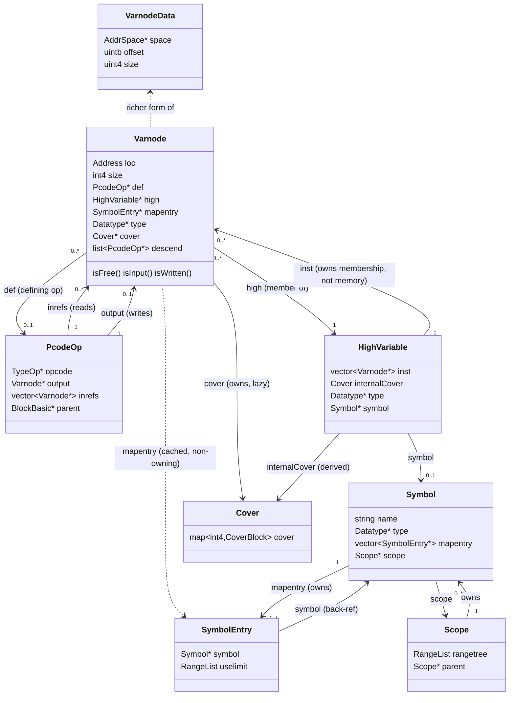
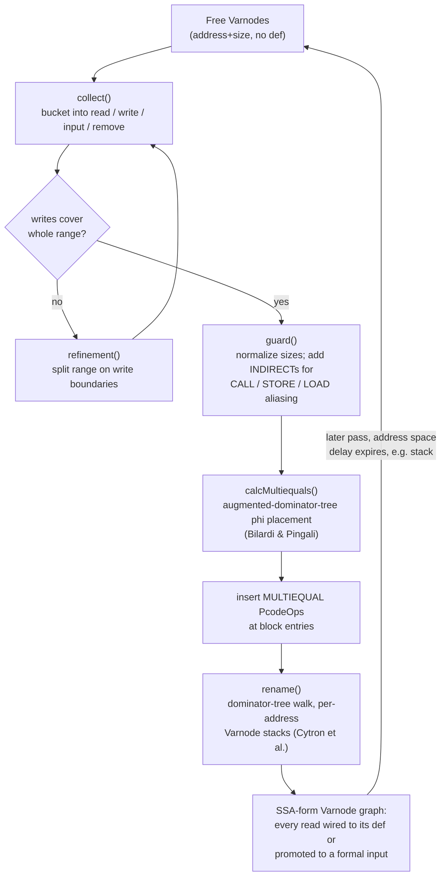

# SSA, Varnodes, and Heritage Construction

> Produced by [`.tasks/0004`](../../.tasks/0004-task-review-ssa-varnode-heritage.md), a child of
> [`.tasks/0002`](../../.tasks/0002-epic-review-current-implementation.md) /
> [`.tasks/0001`](../../.tasks/0001-epic-decompiler-full-refactor.md). Sibling documents:
> [`00-index.md`](00-index.md) (end-to-end narrative),
> [`architecture-pipeline-overview.md`](architecture-pipeline-overview.md) (process model this
> subsystem runs inside),
> [`action-rule-engine.md`](action-rule-engine.md) (the `Action`/`Rule` passes that call into
> `Heritage` and `Merge`). Shared terms live in
> [`../00-overview/glossary.md`](../00-overview/glossary.md).

This document covers `Ghidra/Features/Decompiler/src/decompile/cpp/{funcdata,varnode,variable,op,
pcoderaw,heritage,database,varmap,cover,merge,dynamic,prefersplit,constseq}.{cc,hh}` — the layer
that turns raw P-code (address-space offset + size storage locations, read/written by opcodes) into
the Static Single Assignment (SSA) graph the rest of the decompiler analyzes, and then back into
source-level variables for printing.

## 1. The core object model

Three kinds of object get routinely confused because they all seem to mean "a variable": `VarnodeData`,
`Varnode`, and `HighVariable`/`Symbol`. They live at three different levels of the pipeline.

### 1.1 `VarnodeData` — the wire-level triple

`VarnodeData` (`pcoderaw.hh:35-60`) is a bare `{AddrSpace *space; uintb offset; uint4 size;}` struct —
"a bare-bones container for the data that doesn't have the cached attributes and the dataflow links of
the Varnode" (`pcoderaw.hh:26-34`). It is what SLEIGH/`PcodeOpRaw` (`pcoderaw.hh:110-131`) hands the
decompiler over the wire before any dataflow analysis exists, and it resurfaces later as a lightweight
key type (e.g. `Heritage`'s `LocationMap`, `map<Address,SizePass>` at `heritage.hh:29,48`, and
`PreferSplitRecord::storage` at `prefersplit.hh:28`).

### 1.2 `Varnode` — an SSA graph node

`Varnode` (`varnode.hh:73-354`) is the real unit of dataflow. Per the class comment at
`varnode.hh:57-72`: a `Varnode` is "anything that holds data" — register, stack slot, global, or
constant — identified by an `Address` + size. In its raw form it is **free** (uniquely identified by
that pair); once heritage links it into the SSA graph it is either **written** (has exactly one
defining `PcodeOp`, `def` at `varnode.hh:144`) or an **input**, and — because SSA form gives every
write a fresh name — multiple `Varnode` instances can share the same storage `Address`.

Key fields (`varnode.hh:136-157`):
- `def` — the one defining `PcodeOp*`, or null if free/input.
- `descend` — `list<PcodeOp*>` of every op that *reads* this varnode (the SSA use-list).
- `high` — the owning `HighVariable*` (§1.3), set only after `Funcdata::setHighLevel()` runs.
- `mapentry` — a cached `SymbolEntry*` (§1.3) if this storage is tied to a formal `Symbol`.
- `cover` — a lazily-computed `Cover*` (§4) describing where in the code this SSA value is live.
- `type` — the `Datatype*` (see the type-system review, ticket 0005).
- a `mutable union temp` reused for two unrelated purposes (`Datatype*` during type propagation,
  `ValueSet*` during value-set analysis, `varnode.hh:152-155`) — a small aliasing footgun by design.

`VarnodeBank` (`varnode.hh:366-418`) is the per-function container: two `std::set`s of `Varnode*`,
sorted by storage location (`loc_tree`) and by definition (`def_tree`) respectively
(`varnode.hh:372-373`), used throughout `Funcdata` for lookups like "all varnodes at this address" or
"all varnodes defined by this op-code".

### 1.3 `HighVariable` and `Symbol` — source-level variables

A `HighVariable` (`variable.hh:112-233`) is "a list of low-level variables, each written once" — a
group of `Varnode` instances that, across the whole function, represent one source-level variable for
printing purposes (`variable.hh:100-111`). It is built by `Funcdata::assignHigh()`
(`funcdata_varnode.cc:48-61`), which — once `Funcdata::setHighLevel()` (`funcdata_varnode.cc:625-635`)
has run — allocates a `new HighVariable(vn)` for any `Varnode` that doesn't already have one; merging
(§4) later folds multiple `Varnode`s' `HighVariable`s together.

`HighVariable` caches, and lazily re-derives on a dirty flag (`variable.hh:114-131`), several things
that are really properties of its constituent `Varnode`s: `type`, `internalCover` (union of member
covers), `flags` (union of member flags), and a `symbol`/`symboloffset` pair. `VariablePiece`/
`VariableGroup` (`variable.hh:44-96`) extend this to handle multiple `HighVariable`s that are
sub-pieces of one larger `Symbol` (e.g. a struct decomposed into per-field SSA chains) and need their
covers checked against each other, not just internally.

A `Symbol` (`database.hh:231-317`) is the *formal*, named entity — "at its most basic ... a name and a
data-type" (`database.hh:226-227`) — owned by a `Scope` (`database.hh:523` ff.) in the symbol-table
hierarchy (global scope, namespace scopes, and one `ScopeLocal` per function,
`varmap.hh:221-278`, built over the stack address space). A `Symbol` can have one or more
`SymbolEntry`/`MapEntry` (`database.hh:118-223`) storage mappings — plain `Address`-range storage, or
`DynamicEntry` for values (temporaries, constants) that have no stable address and are instead
identified by a `DynamicHash` over the local dataflow subgraph (`dynamic.hh:43-105`, used e.g. for
naming a `CONCAT` result that only exists as a `unique`-space temporary). `HighVariable` and `Symbol`
are deliberately kept as separate concepts: several `HighVariable`s (e.g. non-contiguous SSA chains for
sub-fields) can point at pieces of one multi-entry `Symbol` (`Symbol::isMultiEntry()`,
`database.hh:297`), which is exactly the "in principal can overlap" case `VariableGroup` exists to
handle (`variable.hh:37-43`).

### 1.4 Diagram

**Reading this**: a `Varnode` is the SSA node; a `HighVariable` is a *display-time* grouping of
`Varnode`s that never intersect in liveness (§4); a `Symbol` is the *formal*, named, typed entity a
`HighVariable` may (or may not — see `HighVariable::isUnattached()`/anonymous temporaries) be tied to.
`VarnodeData` is the primitive `Varnode` is built from and that the wire protocol / SLEIGH still speak.

### 1.5 Ownership and lifetime — flagged as convention-only

The object graph above is built almost entirely of raw pointers with **no smart-pointer or
reference-counting discipline**; correctness depends on invariants documented only in comments and
enforced only by the order code happens to run in:

- **`Varnode` allocation** is individual `new`/`delete` (not pooled) via `VarnodeBank::create()`
  (`varnode.cc:1274-1283`) and `VarnodeBank::destroy()` (`varnode.cc:1300-`), which throws if the
  `Varnode` still has a `def` or descendants (`varnode.cc:1303-1304`) — i.e. lifetime safety is an
  assert, not a type-system guarantee. `PcodeOp` is symmetric via `PcodeOpBank` (`op.hh:296-360`).
- **`HighVariable` lifetime is reference-counted by convention**: `Varnode::~Varnode()`
  (`varnode.cc:634-644`) calls `high->remove(this)` and then `delete high` *only if*
  `high->isUnattached()` (i.e. this was the last member `Varnode`). There is no separate owner; the
  group of `Varnode`s collectively "own" the `HighVariable` through this ad hoc protocol, and any code
  that stashes a bare `HighVariable*` across a point where its last `Varnode` might be deleted (dead-code
  removal, `Funcdata::destroyVarnode`, `funcdata_varnode.cc`) is trusting that convention rather than
  anything the compiler checks.
- **`Varnode::mapentry` (`SymbolEntry*`) is a non-owning cache** into a `Symbol` that is owned, in turn,
  by a `Scope` (`Symbol::~Symbol()` deletes its `SymbolEntry`s at `database.cc:266-271`). Nothing
  invalidates `Varnode::mapentry` if the `Symbol`/`Scope` structure is rebuilt (e.g. by
  `ScopeLocal::restructureVarnode()`, `varmap.hh:271`) except the explicit `clearSymbolLinks()` call
  sites (`varnode.hh:167`) — a dangling-cache risk that is managed by discipline, not enforced.
- **Circular, mixed-direction ownership between `Funcdata` and `FunctionSymbol`**: `FunctionSymbol` owns
  the `Funcdata*` for its function and deletes it in its destructor
  (`database.cc:603-`, `fd = new Funcdata(...)` at `database.cc:613`), while `Funcdata` holds a
  back-pointer `functionSymbol` (`funcdata.hh:82`) that is never itself null-checked against the
  possibility the owner already tore it down mid-decompile.
- **`Varnode::temp` is a `mutable union`** of `Datatype*`/`ValueSet*` (`varnode.hh:152-155`) — reused
  for two different analyses at different pipeline phases; nothing in the type system prevents a stale
  read from the wrong phase, only the discipline of which `Action` runs when (see
  [`action-rule-engine.md`](action-rule-engine.md)).
- By contrast, `Funcdata`'s own big containers (`vbank`, `obank`, `bblocks`, `sblocks`, `heritage`,
  `covermerge`) are plain **value members**, not pointers (`funcdata.hh:92-97`), so their lifetime is
  tied cleanly to `Funcdata` via RAII — the ownership murkiness is specifically in the fine-grained
  cross-references *between* individual `Varnode`/`PcodeOp`/`HighVariable`/`Symbol` objects, not in the
  top-level containers.

## 2. The heritage algorithm

"Heritage" is Ghidra's name for SSA construction: turning raw, address-identified `Varnode` reads and
writes into a proper SSA graph with phi-nodes. The class doc at `heritage.hh:172-206` cites its two
algorithms directly: phi-node placement from Bilardi & Pingali, *"The Static Single Assignment Form and
its Computation"* (1999), and the renaming algorithm from Cytron, Ferrante, Rosen, Wegman & Zadeck,
*"Efficiently computing static single assignment form and the control dependence graph"* (ACM TOPLAS
13(4), 1991) — the canonical SSA-construction paper.

### 2.1 Why it's multi-pass

A single `Funcdata` runs `Heritage::heritage()` (`heritage.cc:2664-2759`) **once per pass**, and
`Funcdata::opHeritage()` (`funcdata.hh:470`) is called repeatedly by the `Action` engine's control loop
until fixed point. This is deliberate, not incidental: register-space dataflow can be heritaged
immediately, but stack-relative locations aren't known to be genuine variables until pointer analysis
has run, so `HeritageInfo::delay` (`heritage.hh:125`, set from `AddrSpace::getDelay()`) lets each
address space "join" SSA form on a later pass (class doc, `heritage.hh:176-190`). `LocationMap`
(`heritage.hh:38-57`) tracks, per disjoint address range, which pass first heritaged it, so a `Varnode`
discovered late (e.g. a stack slot found only after `ScopeLocal::restructureVarnode()` runs) can still
be linked in without redoing everything.

### 2.2 Pipeline within one pass

`Heritage::heritage()` (`heritage.cc:2664-2759`) does, per address space that's due:

1. **Collect free varnodes** at that space into the pass's disjoint range list (`disjoint`,
   `heritage.cc:2700-2733`), tracking passes via `globaldisjoint` (`heritage.hh:239`).
2. **`guard()`** (`heritage.cc:1157-1200`) — before any SSA linking, normalize reads/writes to the
   range's uniform size (`normalizeReadSize`/`normalizeWriteSize`), then, for ranges that might be
   pointed at from elsewhere, call `guardCalls`, `guardReturns`, `guardStores`, `guardLoads`
   (`heritage.cc:1193-1198`). This is the alias-safety step: e.g. `guardStores`/`guardLoads`
   (`heritage.cc:1539-1609`) insert `INDIRECT` ops so that an *unresolved* `STORE`/`LOAD` through a
   dynamic pointer into the same address space is treated as a potential write/read of the range,
   forcing conservative SSA links rather than silently missing an alias. `LoadGuard`
   (`heritage.hh:142-170`) records exactly which `LOAD`s are only partially resolved and what offset
   range they might touch, refined later by value-set analysis
   (`analyzeNewLoadGuards`, `heritage.cc:834-909`).
3. **`placeMultiequals()`** (`heritage.cc:2600-2646`) — the phi-node placement entry point. For each
   disjoint range it calls `collect()` (`heritage.cc:307-347`) to bucket existing `Varnode`s at that
   range into `read`/`write`/`input`/`remove` lists, optionally `refinement()`s the range if writes
   don't uniformly cover it (`heritage.cc:2611-2617`, handling e.g. partial-register writes), then
   `calcMultiequals(writevars)` computes which blocks need a `MULTIEQUAL`, and a real `PcodeOp` of
   opcode `CPUI_MULTIEQUAL` is created and inserted at the start of each such block
   (`heritage.cc:2632-2643`) — this *is* the phi-node.
4. **`calcMultiequals()`** (`heritage.cc:2440-2467`) implements the Bilardi/Pingali placement using a
   pre-built **augmented dominator tree** (`buildADT()`, `heritage.cc:2317-2386`, run once per
   control-flow shape via `maxdepth==-1` check at `heritage.cc:2677`) and a block `PriorityQueue`
   (`heritage.hh:101-110`) ordered by dominator-tree depth; `visitIncr()`
   (`heritage.cc:2395-2429`) is the recursive dominance-frontier walk that actually decides which
   blocks get a phi-node.
5. **`rename()`** (`heritage.cc:2588-2594`) drives `renameRecurse()`
   (`heritage.cc:2480-2563`) — a single depth-first walk of the dominator tree maintaining, per
   storage address, a stack of the currently-visible `Varnode` (`VariableStack`, `heritage.hh:29`).
   Every free read is rewritten to the top of its address's stack (creating a new **input** `Varnode`
   via `fd->setInputVarnode()` if the stack is empty, `heritage.cc:2500-2503` — this is how "illegal"/
   ancestor-unknown inputs get born); every write pushes a new SSA name; `MULTIEQUAL` inputs in
   successor blocks are patched from the current top-of-stack (`heritage.cc:2532-2553`); and on
   backtracking out of a block, that block's writes are popped (`heritage.cc:2559-2562`). This is the
   textbook Cytron et al. renaming pass, walking the dominator tree instead of the CFG directly.
6. Finally `reprocessFreeStores`, `analyzeNewLoadGuards`, `handleNewLoadCopies` refine the LOAD/STORE
   guard set based on what value-set analysis learned this pass, and `pass` is incremented
   (`heritage.cc:2752-2758`).

### 2.3 Data-flow summary

### 2.4 Aliasing and LOAD/STORE interaction

Because P-code models memory as just another address space, a `LOAD`/`STORE` through a *computed*
pointer can touch any `Varnode` in that space without the heritage algorithm being able to see the
concrete address statically. `Heritage` handles this by treating such ops as **potential writers** to
every address they might reach: `guardStores`/`guardLoads` (`heritage.cc:1539-1609`) and the
`discoverIndexedStackPointers`/`generateLoadGuard`/`generateStoreGuard` machinery
(`heritage.cc:910-1156`) insert `CPUI_INDIRECT` ops so the SSA graph conservatively threads the
possibly-aliased value through the `LOAD`/`STORE` rather than treating the two accesses as unrelated.
`LoadGuard::isGuarded()` (`heritage.hh:167`) is later consulted by the `Merge`/`Cover` machinery
(`StackAffectingOps::affectsTest`, `merge.cc:78-89`) to decide whether a specific `STORE` can really
interfere with a specific stack `Varnode`'s liveness, refining the initially-conservative guard as
value-set analysis narrows the possible offset range (`LoadGuard::establishRange`/`finalizeRange`,
declared at `heritage.hh:151-152`).

## 3. `Funcdata` as god object

`Funcdata` (`funcdata.hh:56-630`) is the per-function working set for the whole decompiler. Its own
class comment says it plainly: it "holds the primary data structures for decompiling a function ...
control-flow, data-flow, and prototype information, plus class instances to help with constructing SSA
form, structure control-flow, recover jump-tables, recover parameters, and merge Varnodes. In most
cases it acts as the main API for querying and accessing these structures" (`funcdata.hh:41-47`).

### 3.1 What it owns

Direct members (`funcdata.hh:75-101`):

| Member | Type | Role |
|---|---|---|
| `vbank` | `VarnodeBank` | every `Varnode` in the function |
| `obank` | `PcodeOpBank` | every `PcodeOp` |
| `bblocks` / `sblocks` | `BlockGraph` | raw CFG / structured control-flow hierarchy |
| `heritage` | `Heritage` | SSA construction state (§2) |
| `covermerge` | `Merge` | `Cover`/merge state (§4) |
| `localmap` | `ScopeLocal*` | local symbol scope over the stack space |
| `funcp` | `FuncProto` | recovered prototype |
| `qlst` | `vector<FuncCallSpecs*>` | call-site specs |
| `jumpvec` | `vector<JumpTable*>` | jump-table recovery state |
| `activeoutput` | `ParamActive*` | in-progress return-value recovery |
| `localoverride` | `Override` | per-function analysis overrides |
| `unionMap` | `map<ResolveEdge,ResolvedUnion>` | per-dataflow-edge union-field resolution |

And its public API surface (grep of `funcdata.hh`) spans, by the class's own grouping comment
(`funcdata.hh:48-55`): `PcodeOp` manipulation (`op*` methods, ~70 of them,
`funcdata.hh:451-509`), `PcodeOp`/`Varnode` search and traversal (a dozen-plus `beginLoc`/`endLoc`/
`beginDef`/`endDef`/`beginOp`/`endOp` overloads, `funcdata.hh:342-401,510-539`), `Varnode` creation
(`new*`, `funcdata.hh:285-297`), basic-block/structuring mutation (`funcdata.hh:563-594`), call-spec and
jump-table access (`funcdata.hh:278-281,553-561`), symbol linking (`linkSymbol`, `remapVarnode`,
`buildDynamicSymbol`, `funcdata.hh:435-449`), union-field resolution (`funcdata.hh:544-552`), and a
large block of `#ifdef OPACTION_DEBUG` instrumentation (`funcdata.hh:597-629`). Nested helper classes
defined in the same header — `PcodeEmitFd`, `CloneBlockOps`, `AncestorRealistic`
(`funcdata.hh:636-741`) — extend the surface further.

### 3.2 Why it's shaped this way, historically

The comment at `varnode.hh:76-77` gives the honest reason: "Some [boolean attributes] are calculated
and maintained by the friend classes Funcdata and VarnodeBank" — `Funcdata` is declared `friend` of
`Varnode` (`varnode.hh:160`), `PcodeOp` (`op.hh:65`), and reaches into their private setters directly
(`setDef`, `setOutput`, `setInput`, flag bits, etc.). This mirrors the actual data dependency: nearly
every transformation the decompiler performs — SSA rewriting, type propagation, simplification `Rule`s,
control-flow structuring — needs to *simultaneously* touch a `PcodeOp`, its `Varnode` operands, the
`VarnodeBank`/`PcodeOpBank` indexes those live in, and often the basic-block graph, so keeping them all
reachable from one object avoids threading five separate references through every helper function
call. `Heritage` and `Merge` are constructed holding a back-reference to their owning `Funcdata*`
(`Heritage(Funcdata *data)`, `heritage.hh:317`; `Merge(Funcdata &fd)`, `merge.hh:119`) rather than being
free functions, for the same reason — they need broad, mutating access to the same per-function state.

### 3.3 What the centralization costs

- **Every subsystem is coupled to the concrete `Funcdata` type.** `Action`/`Rule` implementations
  (ticket 0006), block structuring (0007), signature recovery (0008), and the printer (0009) all take
  `Funcdata &data` and call back into dozens of its methods; there is no narrower interface (e.g. "just
  the op-mutation API" or "just the varnode-query API") a given pass could depend on instead, so testing
  or reusing any one concern in isolation means dragging in the whole class.
- **`friend` access defeats encapsulation on the two lowest-level classes.** `Varnode` and `PcodeOp`
  expose large private/protected sections specifically for `Funcdata`'s benefit
  (`varnode.hh:135-178`, `op.hh:123-151`) — the class boundary exists syntactically but not
  semantically; `Funcdata` can and does mutate `Varnode`/`PcodeOp` internal state (flags, `def`,
  in/output pointers) directly rather than through a narrow public contract.
- **~1200 lines in `funcdata.cc` plus three satellite files** (`funcdata_op.cc` 1631 lines,
  `funcdata_varnode.cc` 2334 lines, `funcdata_block.cc` 1114 lines — split by convention, not by class
  boundary, since all four `#include "funcdata.hh"` and define `Funcdata::` methods) means the single
  logical class's implementation is ~6300 lines, making "what does `Funcdata` do" answerable only by
  reading all four files together.
- **Debug/instrumentation state lives on the same object** (`#ifdef OPACTION_DEBUG` block,
  `funcdata.hh:597-629`, ~15 extra fields and methods) — a production per-function object also carries
  conditionally-compiled tracing fields, another sign the class absorbed responsibilities as needed
  rather than by a stable design.
- **Nested helper classes are declared in the same header** rather than owning their own translation
  unit's worth of scope (`PcodeEmitFd`, `CloneBlockOps`, `AncestorRealistic`,
  `funcdata.hh:636-741`) — further evidence the file is the de facto unit of the "SSA/varnode
  subsystem", not the class.

This is the central architectural fact a refactor has to reckon with: `Funcdata` is not merely large,
it is the *integration point* for essentially the entire per-function pipeline, so any staged refactor
(see the eventual `04-solution-research/architecture-options.md`, ticket 0022) needs an explicit story
for how responsibilities peel off it without breaking the "everything reachable from one object" access
pattern every other subsystem currently relies on.

## 4. `Cover` and `Merge` — from SSA back to source variables

SSA form is precise but unprintable directly: a loop counter that's incremented five times becomes five
different `Varnode`s, and a human reader expects one variable `i`. `Cover` and `Merge` are how the
decompiler decides which `Varnode`s can be safely presented as "the same variable" without changing
the function's meaning.

### 4.1 `Cover` — topological liveness

A `Cover` (`cover.hh:108-131`) approximates, per basic block, the contiguous range of `PcodeOp`s over
which a `Varnode`'s SSA value is "in scope" — from its `CoverBlock::setBegin()` def-point to the last
`CoverBlock::setEnd()` use, represented as a `map<int4,CoverBlock>` keyed by block index
(`cover.hh:109`). The class comment states the invariant merging depends on: "In order to merge
Varnodes into a HighVariable, the topological scope of each Varnode must not intersect because that
would mean the high-level variable holds different values at the same point in the function"
(`cover.hh:102-105`). `Cover::intersect()` (`cover.hh:116`) returns a tri-state result (no intersection
/ partial / total) that `Merge` and `HighIntersectTest` (`variable.hh:258-272`) use directly.
`PcodeOpSet`/`affectsTest()` (`cover.hh:29-65`) is the escape hatch for ops that intersect a `Cover`
range positionally but don't actually *affect* the variable's value — e.g. an unrelated `STORE` through
a pointer that `LoadGuard::isGuarded()` proves can't reach this particular stack slot
(`merge.cc:78-89`).

### 4.2 `Merge` — the grouping policy

`Merge` (`merge.hh:83-139`) runs *after* heritage, as a sequence of `Action` passes (see
`ActionMergeRequired`, `ActionMergeAdjacent`, `ActionMergeCopy`, `ActionMergeMultiEntry`,
`ActionMergeType` in `coreaction.hh:363-417`, each simply forwarding to a `Merge` method — e.g.
`data.getMerge().mergeAddrTied()` at `coreaction.hh:372`). The class comment draws the
line the ticket asks about explicitly (`merge.hh:69-82`):

- **Forced merges** *must* happen, and the algorithm will insert extra `Varnode`s/`COPY`s to make covers
  disjoint if needed: `MULTIEQUAL`/`INDIRECT` input-output pairs (`mergeMarker`), varnodes at the same
  persistent/global storage, and varnodes at the same mapped stack location (`mergeAddrTied`,
  `merge.cc:609`).
- **Speculative merges** are attempted opportunistically to reduce variable count (single-op input/
  output pairs, same-datatype varnodes, `mergeByDatatype` `merge.cc:359`) but are simply *abandoned*,
  with no dataflow change, if a `Cover` intersection is found.

`Merge::mergeTestRequired()` (`merge.cc:102-`) encodes the "OK to merge" precondition checks that are
independent of `Cover` — different locked datatypes, one address-tied and one not, an input merging
with a persistent (global) variable, etc. — short-circuiting before the (more expensive) `Cover`
intersection test in `Merge::merge()` (`merge.cc:1565-1575`), which calls
`testCache.intersection(high1,high2)` (backed by `HighIntersectTest`, `variable.hh:258-272`, which
caches pairwise test results keyed by `HighEdge`, `variable.hh:239-247`, so repeated tests across many
merge attempts in one function don't re-walk every `Cover` from scratch) and only proceeds to
`high1->merge(high2, ...)` if there's no intersection.

### 4.3 Where it can go wrong

- **Merge conflicts surface as `Symbol::merge_problems`** (`database.hh:266,298-299`): if a
  multi-`SymbolEntry` `Symbol` has pieces whose `Cover`s genuinely intersect (the source-level variable
  really does hold two different SSA values live at the same program point across its storage
  locations), the merge is refused and `hasMergeProblems()` is set rather than silently producing wrong
  output — but the two SSA pieces still have to be *displayed* as one named `Symbol`, which is exactly
  the case `VariableGroup`/`VariablePiece` extended covers exist to reconcile (`variable.hh:37-96`,
  `intersectdirty`/`extendcoverdirty` flags at `variable.hh:129-130`).
- **`Symbol::isolate`** (`database.hh:265,300-301`) is an explicit user/heuristic override to stop
  speculative auto-merging for a `Symbol` altogether — an acknowledgment that the speculative heuristics
  sometimes produce a *plausible but wrong* grouping that a human has to veto.
- **Aliasing false-negatives are conservative by construction**: because `guardStores`/`guardLoads`
  (§2.4) already forced `INDIRECT`s wherever a computed pointer *might* touch a range, `Cover`
  intersections arising from those `INDIRECT`s can block a merge that would have been semantically fine
  had the alias been provably absent — i.e. the merge algorithm trades some over-conservatism (more
  distinct displayed variables than strictly necessary) for soundness, and `LoadGuard` refinement
  (value-set analysis narrowing the guarded range, `heritage.cc:834-909`) is the main lever for
  recovering precision.
- **HighVariable dirtiness is itself a hand-maintained cache-invalidation protocol** — nine separate
  dirty bits (`variable.hh:119-131`: `flagsdirty`, `namerepdirty`, `typedirty`, `coverdirty`,
  `symboldirty`, `copy_in1`/`copy_in2`, `type_finalized`, `unmerged`, `intersectdirty`,
  `extendcoverdirty`), each cleared by a specific `update*()` method (`variable.hh:148-152`) that must
  be called by the right code path at the right time; a missed dirty-mark is a latent stale-cache bug
  class, not something the type system catches.

## 5. Mini glossary

(Mirrored into [`../00-overview/glossary.md`](../00-overview/glossary.md); definitions here are
scoped specifically to this document's subject matter.)

- **VarnodeData** — the minimal wire-level `{space, offset, size}` triple with no dataflow links; what
  raw P-code and SLEIGH speak before any SSA construction. `pcoderaw.hh:35`.
- **Varnode** — an SSA graph node: one instance per unique def in SSA form, at a storage `Address` +
  size, with a `def` `PcodeOp*` and a `descend` list of reading ops. `varnode.hh:73`.
- **PcodeOp** — one P-code operation: an opcode, an ordered list of input `Varnode*`s, and at most one
  output `Varnode*`. `op.hh:63`.
- **HighVariable** — a set of `Varnode`s, grouped post-heritage by `Merge` because their `Cover`s never
  intersect, presented as one source-level variable for printing. `variable.hh:112`.
- **Symbol** — the formal, named, typed entity in the scope/symbol-table hierarchy that a
  `HighVariable` may be tied to via one or more `SymbolEntry` storage mappings. `database.hh:231`.
- **Heritage** — the per-function SSA-construction pass: phi-node (`MULTIEQUAL`) placement via an
  augmented dominator tree, followed by dominator-tree-walk renaming; runs in multiple passes to let
  different address spaces (registers, then stack) join SSA form as they're discovered. `heritage.hh:207`.
- **Cover** — the topological liveness range (per basic block, def-point to last use) of a single
  `Varnode`'s SSA value; the primitive that `Merge` intersection-tests before grouping `Varnode`s into
  a `HighVariable`. `cover.hh:108`.
- **Merge** — the post-heritage pass that groups `Varnode`s into `HighVariable`s, split into *forced*
  merges (must happen, may insert `COPY`s to force disjoint covers) and *speculative* merges (attempted,
  abandoned on any `Cover` intersection). `merge.hh:83`.
- **LoadGuard** — a record of a `LOAD`/`STORE` through a computed pointer whose target range is only
  partially known; used both to force conservative `INDIRECT` aliasing during heritage and later to
  scope down `Merge`'s intersection tests once value-set analysis narrows the range. `heritage.hh:142`.
- **DynamicHash** — a hash over a small local dataflow subgraph, used to identify `Varnode`s (typically
  `unique`-space temporaries or constants) that have no stable storage `Address` a `Symbol` could
  otherwise be pinned to. `dynamic.hh:62`.
