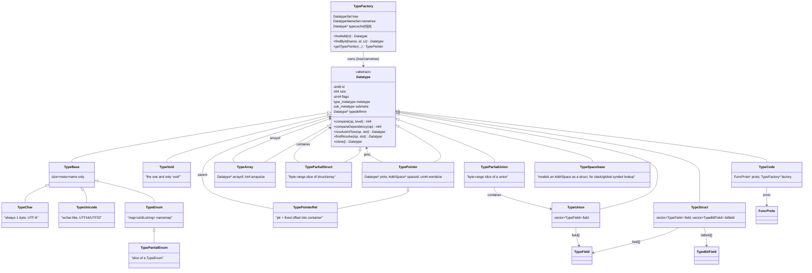
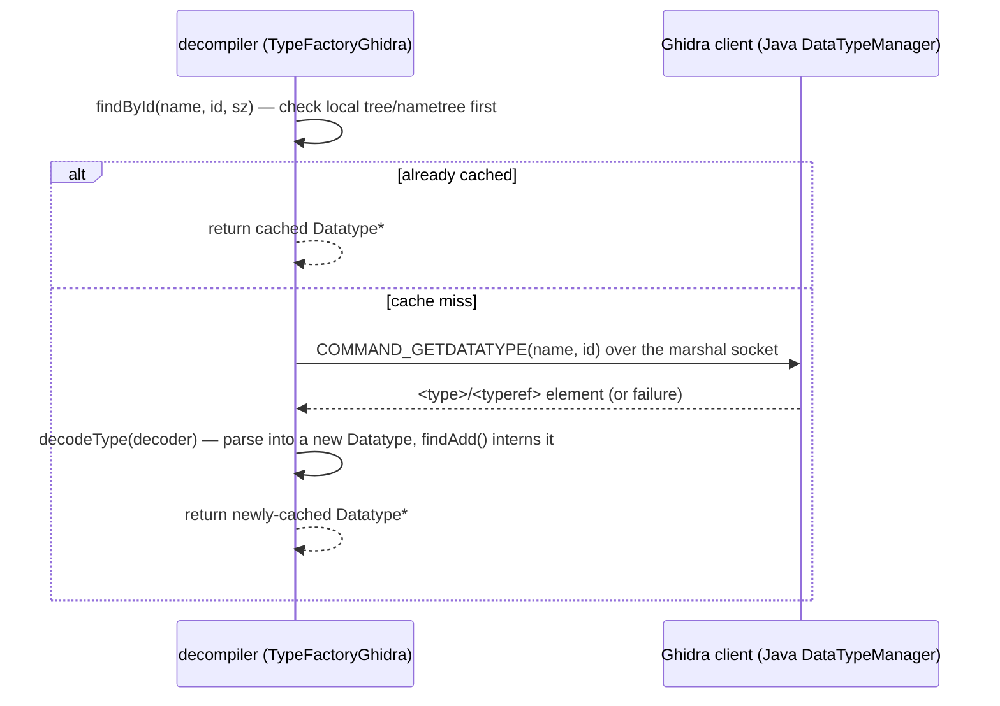
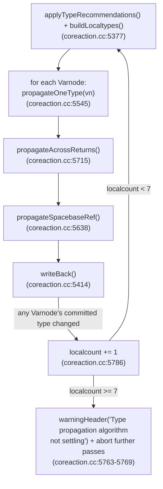

# Type System Review

Ticket: [`.tasks/0005-task-review-type-system.md`](../../.tasks/0005-task-review-type-system.md) (parent:
[`.tasks/0002`](../../.tasks/0002-epic-review-current-implementation.md) /
[`.tasks/0001`](../../.tasks/0001-epic-decompiler-full-refactor.md)).
Sibling documents: [`ssa-varnode-heritage.md`](ssa-varnode-heritage.md) (Varnode/typelock consumer side),
[`signature-calling-conventions.md`](signature-calling-conventions.md) (`FuncProto`, which `TypeCode`
wraps), [`action-rule-engine.md`](action-rule-engine.md) (`ActionInferTypes` lives in the Action/Rule
engine covered there), [`00-index.md`](00-index.md).

All citations are `path/to/file:line` relative to
`Ghidra/Features/Decompiler/src/decompile/cpp/` unless a full path is given.

## 1. Scope note: `signature.hh`/`signature_ghidra.hh` are not what the name suggests

The ticket's file list describes `signature.cc/hh, signature_ghidra.cc/hh` as "function
signature/prototype typing". Having read them, **that description is wrong** — worth flagging
explicitly since it could mislead later work. These files implement a completely different
subsystem: a **binary similarity / clone-detection feature-vector hasher** (`Signature`,
`SignatureEntry`, `GraphSigManager`, `SigManager` — `signature.hh:50`, `signature.hh:78`,
`signature.hh:265`). It walks a decompiled function's data-flow/control-flow graph and produces a
vector of 32-bit hashes (`VarnodeSignature`, `BlockSignature`, `CopySignature` — `signature.hh:183-222`)
for fingerprinting/matching functions across binaries — conceptually adjacent to FunctionID/BinDiff, not
to C-style function prototypes. `signature_ghidra.hh:29` registers the Ghidra-client-facing commands
(`SignaturesAt`, `GetSignatureSettings`, `SetSignatureSettings`) that drive this. It has **no
relationship** to `FuncProto`/prototype recovery, which lives in `fspec.hh`/`fspec.cc` and is covered by
[`signature-calling-conventions.md`](signature-calling-conventions.md) (ticket 0008). The only
type-system linkage is incidental: it is included via `funcdata.hh` and its features can reference
`Datatype` sizes. It is documented briefly here for completeness (it was in-scope per the ticket's file
list) but is otherwise irrelevant to type propagation, and readers looking for prototype/signature
*typing* should go to ticket 0008's document instead.

## 2. The `Datatype` class hierarchy

`Datatype` (`type.hh:168`) is the abstract base for every data-type object the decompiler works with —
symbol types, `Varnode` types, function-prototype parameter/return types, cast targets. It carries:

- `id` (`uint8`) — an interning key, see §3.
- `size`, `alignment`, `alignSize` — byte size and alignment.
- `metatype` (`type_metatype`, `type.hh:80-100`) — a *size-disregarding* coarse kind (`TYPE_INT`,
  `TYPE_STRUCT`, `TYPE_PTR`, …). The enum's numeric ordering is significant: it indexes
  `Datatype::base2sub[18]` (`type.hh:178`) which maps each meta-type to a default `sub_metatype`.
- `submeta` (`sub_metatype`, `type.hh:104-129`) — a finer-grained ordering key used only for
  type-propagation comparisons (`compare()`), *not* identity. Its doc comment is explicit that "the
  lower the number, the more specific the data-type, affecting propagation" (`type.hh:102-103`).
- `flags` (`uint4`) — ~19 boolean properties packed into one word, including `coretype`, `chartype`,
  `enumtype`, `type_incomplete`, `needs_resolution`, `has_bitfields`, `is_ptrrel`,
  `has_stripped` (`type.hh:180-198`).

### 2.1 Class diagram

Verified directly against `type.hh` (every class/relationship below has a citation).

Class-by-class citations: `TypeBase` `type.hh:397`, `TypeChar` `type.hh:413`, `TypeUnicode`
`type.hh:429`, `TypeVoid` `type.hh:446`, `TypePointer` `type.hh:460`, `TypeArray` `type.hh:502`,
`TypeEnum` `type.hh:540`, `TypeStruct` `type.hh:577`, `TypeUnion` `type.hh:630`, `TypePartialEnum`
`type.hh:659`, `TypePartialStruct` `type.hh:681`, `TypePartialUnion` `type.hh:708`, `TypePointerRel`
`type.hh:740`, `TypeCode` `type.hh:787`, `TypeSpacebase` `type.hh:816`, `TypeFactory` `type.hh:847`,
`TypeField` `type.hh:322`, `TypeBitField` `type.hh:339`.

Notable shape observations:

- **The "partial" family is a parallel taxonomy, not a subtype relationship.** `TypePartialEnum`
  inherits from `TypeEnum` (code reuse for `Representation`/`hasNamedValue`), but `TypePartialStruct`
  and `TypePartialUnion` inherit directly from `Datatype`, *not* from `TypeStruct`/`TypeUnion`, even
  though conceptually a "partial struct" is obviously struct-related. All three exist to represent
  "some byte range that is provably inside a bigger aggregate but whose exact sub-field is not (yet)
  resolvable" (`type.hh:680-733`) — see §5 for how this bears on the overlap list.
- **`TypePointerRel` is a specialization-by-composition of `TypePointer`**, adding a `parent` container
  and byte `offset` (`type.hh:740-779`). It is explicitly documented as *ephemeral*: `markEphemeral()`
  (`type.hh:1037-1054`) caches a plain `TypePointer` (`stripped`) that replaces it in formal declarations
  — a `TypePointerRel` only exists to carry extra context through propagation, it is never itself
  "the" declared type of a variable (`isFormalPointerRel()`, `type.hh:237`).
- **`TypeCode` owns a `FuncProto*`** (`type.hh:790`), so a C-style function-pointer type is a
  `TypeCode` wrapping a full recovered prototype — see §6.3 for the limitation this implies for
  member-function pointers.

### 2.2 Core vs. dynamically-registered types

"Core" types are the architecture's built-in primitives (`void`, `char`, `int`, `uint`, `float4`, …),
parsed once at start-up from a `<coretypes>` config element via `TypeFactory::decodeCoreTypes`
(`type.cc:5255`) and `TypeFactory::setCoreType` (`type.cc:3803`), then marked with the `coretype` flag
(`type.cc:3819`, tested by `isCoreType()` at `type.hh:226`) meaning "this is a basic type which will
never be redefined" (`type.hh:181`). `TypeFactory::cacheCoreTypes()` (`type.cc:3825`) additionally
memoizes the commonly-used ones into a small direct-indexed matrix, `typecache[9][8]`
(`type.hh:859`), so that e.g. "the 4-byte unsigned int" is a cache hit rather than a tree lookup.

Every other `Datatype` — every struct, union, array, pointer, enum, and every atomic size/sign
combination not pre-cached — is **dynamically registered on first use** via `TypeFactory::findAdd()`
(`type.cc:4056`, walked through in §3) or fetched across the wire from Ghidra's own database
(`TypeFactoryGhidra::findById`, §4). There is no other formal "kind" distinction; `coretype` is the
only flag bit that marks a type as structurally immutable.

## 3. Interning: the id/name scheme and why it matters

Every `TypeFactory` owns exactly one `DatatypeSet tree` (sorted by `DatatypeCompare`, which orders on
`compareDependency()` then `id`, `type.hh:371-377,389`) and one `DatatypeNameSet nametree` (sorted by
name then `id`, `type.hh:380-386,392`). **All `Datatype*` pointers the rest of the decompiler holds
are pointers into one of these two sets** — types are canonicalized/interned, not value objects, so
pointer equality is used everywhere as type equality (e.g. `TypeUnion::findCompatibleResolve`,
`type.cc:2725-2745`, compares `field[i].type == ct`).

- **`compare(op, level)`** (`type.cc:229`, overridden per subclass) orders types for the *propagation*
  algorithm: "bigger types come earlier, more specific types come earlier" — first by `submeta`, then
  by `size`. This is what `Datatype::typeOrder()` (`type.hh:308`) uses to decide whether a candidate
  type is a strict improvement over an existing one during propagation (§7).
- **`compareDependency(op)`** (`type.cc:244`, overridden per subclass) orders types for *storage in the
  `tree`* — it must not look at `id` (a synthetic, decode-order-independent value being compared
  against a freshly-constructed example type), and in practice only needs to descend one level into
  component pointers rather than recursing structurally (`type.cc:237-241`).
- **id generation**: an explicit id (typically Ghidra's own datatype id, propagated across the wire) is
  preferred; if a type is created without one, `Datatype::hashName()` (`type.cc:802`) hashes the name
  into a 64-bit id with the top two bits forced to `11` to mark it as a "name hash" rather than an
  authoritative id (`type.cc:812`). **Variable-length types** (flag `variable_length`, e.g. Ghidra
  "flexible array" structures) additionally run the id through `Datatype::hashSize()`
  (`type.cc:822`), a reversible XOR-based mix of `id` and `size`, so that two same-named structures of
  different concrete sizes get distinct, de-duplicatable ids (`getUnsizedId()` reverses this,
  `type.hh:984-995`).
- **`TypeFactory::findAdd(ct)`** (`type.cc:4056`) is the single choke point for turning an
  ad-hoc/example `Datatype` (typically stack-constructed by a `getTypeXxx()` helper) into the
  canonical interned instance: if the candidate is named, it *requires* a non-zero id
  (`type.cc:4062-4063`, throws `LowlevelError` otherwise) and looks it up by name+id via
  `findByIdLocal()` (`type.cc:3970`); if found, it asserts the existing type's `compareDependency()`
  agrees (`type.cc:4066-4067`, throwing **"Trying to alter definition of type: …"** if a same-named,
  same-id type is redefined incompatibly — this is a real correctness trap, see §8). If unnamed, it
  falls back to structural lookup via `findNoName()`/`tree.find()` (`type.cc:4021-4029`). Only on a
  genuine miss does it `clone()` and `insert()` (`type.cc:4034-4050`, which itself throws **"Shared
  type id"** on an id collision).

**Why this matters for correctness**: because identity is by-pointer and canonicalization is
name+id-keyed, any code path that constructs a `Datatype` *without* routing it through
`TypeFactory::findAdd`/`getTypeXxx()` risks a second, non-interned copy that will silently fail
pointer-equality checks used throughout propagation and union resolution (`TypeUnion::compare`,
`findCompatibleResolve`, symbol matching, etc.). The `findAdd` throws above are the system's only
built-in guard against a worse failure mode: two *different* structural definitions quietly sharing
one id.

## 4. The Ghidra ↔ decompiler type bridge

The decompiler's C++ process (`libdecomp`) and Ghidra's Java-side `DataTypeManager` are two
**independently-maintained, DB-backed type systems** that must be kept in sync for the duration of one
decompile. The bridge is one-directional and lazy, built on `TypeFactoryGhidra`:

- **`TypeFactoryGhidra`** (`typegrp_ghidra.hh:32`) overrides the single virtual extension point,
  `findById()` (`typegrp_ghidra.cc:20`): it first tries the normal in-process lookup
  (`TypeFactory::findById`, `type.cc:3998`), and only on a miss issues a
  `getDataType(name, id, decoder)` request to the live `ArchitectureGhidra` connection
  (`ghidra_arch.cc:675`), which marshals a `COMMAND_GETDATATYPE` packet over the process's socket and
  blocks for a `<type>` (or `<typeref>`) response. `decodeType()` (`type.cc:4842`) parses that response
  and interns it exactly as any locally-constructed type would be (§3) — from that point on it is
  indistinguishable from a native type.
- The wire encoding itself supports two shapes: a full `<type>` definition, or a `<typeref>` — just a
  name + id (+ optional size for variable-length types) that must already resolve locally
  (`type.cc:4847-4869`); this is how recursive/self-referential struct definitions and repeated
  references avoid re-sending full bodies.
- **`ConstantPoolGhidra`** (`cpool_ghidra.hh:33`, `cpool_ghidra.cc`) is the same pattern one level
  up: a `ConstantPoolInternal` cache (`cpool.hh:166`) is checked first (`cpool_ghidra.cc:35`), and only
  a miss triggers a `getCPoolRef()` round-trip (`cpool_ghidra.cc:40`) — relevant for Java-bytecode-origin
  programs where `CPUI_CPOOLREF` resolves class/field/method references via `CPoolRecord`
  (`cpool.hh:56`) to a `Datatype`.

### 4.1 Sync mechanism and failure modes

**There is no push/invalidation channel from Ghidra to the decompiler for individual type edits.**
Once `TypeFactoryGhidra::findById` caches a type, it stays cached — indefinitely, across every function
subsequently decompiled by that same `libdecomp` process — with no mechanism shown in this scope to
detect that the *same* name+id now describes a different structure back on the Ghidra side. The only
invalidation path found is coarse and explicit: the Java side can send a `FlushNative` command
(`ghidra_process.cc:255-266`), which calls `ghidra->types->clearNoncore()` (`ghidra_process.cc:261`,
`TypeFactory::clearNoncore`, declared `type.hh:896`) — this wipes **every** non-core cached type (and
the symbol table, comment DB, string cache, and constant pool) in one shot. There is no per-type or
partial invalidation.

Concrete failure modes this implies:

1. **Stale-type risk under long-lived processes.** If a user edits a structure in Ghidra's data-type
   manager mid-session without the Java front end issuing a full `FlushNative`, any decompile that
   reuses the cached `TypeFactoryGhidra` will keep using the old field layout. (Whether the Java side
   *always* flushes on every relevant edit is a Java-side/front-end concern outside this document's
   file-list scope — worth a follow-up question for ticket 0010's Java-integration review.)
2. **`findAdd`'s "Trying to alter definition of type"** (`type.cc:4067`, §3) is a *symptom* of the same
   underlying gap: it is the in-process guard that fires when a second, structurally different
   definition arrives for a name+id the local cache already has cached from an earlier point in the
   session — i.e., the bridge has no way to *reconcile* two definitions, only to detect the conflict and
   throw a `LowlevelError` that aborts the current decompile.
3. **One id space, two authorities.** Ids normally originate from Ghidra's own database, but the
   decompiler can also synthesize ids locally via `hashName()`/`hashSize()` (§3) for types it invents
   itself (typedefs decoded without an explicit id, anonymous partial/relative types, etc.). The two id
   spaces are distinguished only by the high-bit convention (`0xC0...` prefix marks a name-hash id,
   `type.cc:812`) — an informal convention rather than an enforced partition, so a crafted or
   corrupted id from either side could in principle collide with the other's numbering.
4. **Fully synchronous, blocking round-trips.** Every cache miss blocks the decompile thread on a
   full socket round-trip to the Java process (`ghidra_arch.cc:675-690`); there is no batching/prefetch
   of related types (e.g. a struct's field types are each looked up on first touch, not eagerly), so a
   large, deeply-nested, not-yet-cached type graph costs one round-trip per distinct sub-type.

## 5. Type propagation and `typelock` semantics

### 5.1 Where it runs

`ActionInferTypes` (`coreaction.hh:987`) is the `Action` (see
[`action-rule-engine.md`](action-rule-engine.md) for the Action/Rule framework itself) that drives type
propagation. Its `apply()` (`coreaction.cc:5747`) runs one full propagation *pass* per invocation, and
the fixed-point engine re-invokes it as long as anything changes:

1. **`buildLocaltypes(data)`** (`coreaction.cc:5377`) assigns each `Varnode` a *local* seed type —
   from its type-locked `SymbolEntry`'s exact byte-piece if one exists and resolves to something better
   than `TYPE_UNKNOWN` (`coreaction.cc:5391-5397`), otherwise from `Varnode::getLocalType()` (purely
   local inference from the defining/using `PcodeOp`s) — into a **temporary** field (`setTempType`),
   not the committed `type` field yet.
2. **`propagateOneType(typegrp, vn)`** (`coreaction.cc:5545`) does an explicit-stack DFS
   (`PropagationState`, `coreaction.cc:5488-5533`) outward from one Varnode across every
   read/write edge reachable in the data-flow graph, calling **`propagateTypeEdge`**
   (`coreaction.cc:5445`) on each `(op, inslot, outslot)` triple. That function:
   - Refuses to propagate through an output that `isTypeLock()` (`coreaction.cc:5465`) — **this is the
     enforcement point for `typelock`**, see §5.2.
   - Refuses if the target Varnode `stopsUpPropagation()` (a "block" set by `buildLocaltypes` when
     `getLocalType` signals its local evidence is not trustworthy to push further, `coreaction.cc:5466`
     with the block set at `coreaction.cc:5401-5402`).
   - Special-cases `TYPE_BOOL` so a non-boolean-valued Varnode can't get contaminated by boolean
     propagation (`coreaction.cc:5468-5471`).
   - Delegates the actual type *transformation* across the op to
     **`TypeOp::propagateType()`** (§5.3) and only accepts the result if it is strictly more specific
     under `typeOrder()` than what the target already holds (`coreaction.cc:5477`, using `compare()`
     from §3) — this both drives convergence and prevents oscillation.
   - Special-cases `needsResolution()` inputs (unions/pointers-to-union) by calling
     `resolveInFlow()` before propagating (`coreaction.cc:5453-5457`) — see §6.
3. **`propagateAcrossReturns`** (`coreaction.cc:5715`) additionally unifies the type across multiple
   `CPUI_RETURN` sites within one function (a function has one return type; if several `return`
   statements disagree, the "canonical" one — computed by `canonicalReturnOp`, `coreaction.cc:5684`, as
   the most-specific by `typeOrder` — wins and is pushed to the others).
4. **`propagateSpacebaseRef`/`propagateRef`** (`coreaction.cc:5638`, `5581`) propagate a recovered
   pointer's pointed-to type to *other, aliased* Varnodes at the same stack/global address — the
   mechanism by which one strongly-typed access to a stack slot or global retroactively types every
   other Varnode that shares that storage.
5. **`writeBack(data)`** (`coreaction.cc:5414`) is the only place the temporary type is committed to the
   real `Varnode::type` field, via `Varnode::updateType(ct)` (`varnode.cc:480`) — which itself
   refuses to change a type-locked Varnode (`varnode.cc:483`) and marks the owning `HighVariable` dirty
   (`high->typeDirty()`) so downstream passes (cast insertion, printing) know to re-evaluate it.
6. The whole pass repeats until `writeBack` reports no change, capped at 7 rounds
   (`coreaction.cc:5763`, "This constant arrived at empirically" — an undocumented magic number) after
   which the pass gives up, emits a **"Type propagation algorithm not settling"** warning into the
   decompiled output, and marks `setTypeRecoveryExceeded()` (`coreaction.cc:5765-5766`) rather than
   looping indefinitely — i.e. non-convergence is a known, tolerated failure mode with a hard bailout,
   not something the ordering relation is proven to preclude.

### 5.2 `typelock` / confidence semantics

`Varnode` flags include `typelock` ("The Datatype of the Varnode is locked", `varnode.hh:90`) and
`namelock` (`varnode.hh:91`), tested by `isTypeLock()`/`isNameLock()` (`varnode.hh:301-302`). A lock is
the system's only notion of "confidence" — there is no numeric/graded confidence score anywhere in
propagation; a type is either freely overwritable or completely frozen.

- Locks are seeded from `Symbol::isTypeLocked()`/`isNameLocked()` when a `Varnode` maps to a
  user-declared or database-declared `Symbol` (`Varnode::setSymbolProperties`, `varnode.cc:434-448`,
  and `setSymbolEntry`, `varnode.cc:453-463`) — i.e. an explicit type assigned in Ghidra (function
  parameter type, global variable type, structure field type, …) becomes a hard constraint the
  propagation engine must never overwrite.
- `Varnode::updateType(ct, lock, override)` (`varnode.cc:498`) is the general-purpose setter used
  outside the main propagation loop (e.g. explicit user retyping): it force-unlocks on `TYPE_UNKNOWN`
  ("Unknown data type is ALWAYS unlocked", `varnode.cc:501-502`), refuses to change an existing lock
  unless `override` is passed, and no-ops if nothing would actually change
  (`varnode.cc:504-505`).
- The two-argument `updateType(ct)` (`varnode.cc:480`, used by `writeBack`) is strictly weaker: it
  never sets or clears the lock, it only refuses outright if already locked
  (`type == ct || isTypeLock()) return false`, `varnode.cc:483`) — so the propagation engine can
  *never* lock or unlock a Varnode, only fill in/refine an unlocked one.
- `copySymbol()` (`varnode.cc:517-529`) explicitly copies both `typelock` and `namelock` bits when
  transferring symbol information between Varnodes (e.g. during SSA-merge/`HighVariable`
  construction), so a lock survives that operation rather than needing to be re-derived.

### 5.3 `TypeOp`: per-opcode propagation rules

`TypeOp` (`typeop.hh:39`) is the per-`OpCode` policy object — one instance per P-code opcode, held by
the main `PcodeOp` as "a representative of the op-code" (`typeop.hh:36`). It bundles emulation
(`evaluateUnary/Binary/Ternary`, delegating to `OpBehavior`), display, and four data-type-specific
virtuals that together define how types flow through that opcode:

- `getOutputLocal`/`getInputLocal` (`typeop.hh:149,152`) — the *minimal* type an operand can be
  inferred to have purely from local evidence (used by `buildLocaltypes`, §5.1 step 1).
- `getOutputToken`/`getInputCast` (`typeop.hh:155,158`) — the type a compiler *would* assign, used by
  the cast-insertion/printing side (see [`expression-cast-printer.md`](expression-cast-printer.md)),
  not by propagation itself.
- **`propagateType(alttype, op, invn, outvn, inslot, outslot)`** (`typeop.hh:161`) — the actual
  propagation transform: given an incoming type on one edge endpoint, compute the resulting type (or
  null to refuse) on the other endpoint. The base class default is a conservative no-op; concrete
  opcodes override it when a meaningful, opcode-specific transformation exists.

`TypeOpBinary`/`TypeOpUnary`/`TypeOpFunc` (`typeop.hh:204,221,238`) are thin generic bases carrying a
fixed input/output meta-type pair for opcodes with no special-cased behavior; most arithmetic/logical
opcodes (`TypeOpIntXor`, `TypeOpIntAnd`, …) subclass one of these and only override `propagateType`
where pointer-vs-integer semantics need distinguishing.

**Worked example — pointer arithmetic through `INT_ADD`** (`typeop.cc:1203-1275`):
`TypeOpIntAdd::propagateType` refuses to propagate unless one side is `TYPE_PTR` (or the edge is a
constant addend, `typeop.cc:1206-1214`), then computes the transformed pointer type via
`propagateAddIn2Out` → `TypePointer::downChain` (`type.cc:1313`), which walks the pointed-to
aggregate's `getSubType(off, &off)` one level at a time — into struct fields, array elements, or (for
an enum) down to its underlying integer type (`type.cc:1331-1336`) — re-normalizing the offset each
step, and, if it crosses a struct/array boundary, records the outer container as a `TypePointerRel`
(§2.1) so the "this pointer used to be relative to a known struct" context survives even once the
literal offset resolves to `0` (`typeop.cc:1255-1264`). `propagateAddPointer`
(`typeop.cc:1290`) classifies the edge as "add a constant that is exactly zero" (a `PTRSUB`/`PTRADD`
idiom), "add a nonzero constant", "doesn't look like pointer arithmetic" (propagation refused), or
"opaque, propagate untransformed" — four qualitatively different outcomes from one opcode, illustrating
how much opcode-specific logic sits behind the single `propagateType` virtual.

## 6. Union/struct field resolution

Because a `TYPE_UNION` (or a pointer/partial into one) is, by construction, ambiguous — the same bytes
simultaneously "are" every field — the decompiler defers picking a concrete field until it sees how the
value is actually used, via a dedicated subsystem in `unionresolve.hh/cc`:

- **`Datatype::needsResolution()`** (`type.hh:240`, backed by the `needs_resolution` flag,
  `type.hh:192`) marks any type that requires this treatment: every `TypeUnion` unconditionally
  (`type.hh:638`), a `TypePartialUnion` (`type.cc:2965`), a size-1 `TypeArray` (treated as its single
  element, `type.hh:1033-1034`), and a `TypePointer` when its `ptrto` is one of those
  (`type.cc:1281,1574,1805,2297`).
- **`ResolvedUnion`** (`unionresolve.hh:39`) is the resolution record: a `baseType` (the union/struct
  being resolved, with pointers/partials stripped), a `fieldNum` (`-1` meaning "resolves to the parent
  itself"), and a `lock` bit so a resolution — once pinned, e.g. by a user override — is not silently
  recomputed. `ResolveEdge` (`unionresolve.hh:63`) keys a resolution by `(typeId, PcodeOp, slot)`, and
  `ResolveCache` (`unionresolve.hh:180`, owned per-`Funcdata`) stores/looks up/propagates resolutions
  as new Varnodes inherit them along data-flow (`inheritResolution`, `unionresolve.hh:196-206`).
- **`Datatype::resolveInFlow(op, slot)`** (virtual, `type.hh:299`) is the entry point called from
  `propagateTypeEdge` (§5.1) whenever the incoming type `needsResolution()`. `TypeUnion::resolveInFlow`
  (`type.cc:2617`) and `TypePointer::resolveInFlow` (`type.cc:1361`, for pointer-to-union) both follow
  the same order: check the per-`(op,slot)` cache (`Funcdata::getUnionField`), then an
  *address-based* cached resolution (`getAddressBasedUnionField` — resolutions keyed by storage address
  rather than specific op, letting a resolution made at one access site propagate to other accesses of
  the same memory), and only on a full miss run **`ScoreUnionFields`** (`unionresolve.hh:86`) to compute
  one from scratch.
- **`ScoreUnionFields`** is a bounded heuristic search: starting from the access site it builds a
  worklist of `Trial`s (`unionresolve.hh:88`) that push each candidate field's type *up* or *down* the
  data-flow graph (`scoreTrialUp`/`scoreTrialDown`) — following LOAD/STORE dereferences
  (`derefPointer`), constant fits (`scoreConstantFit`), locked types on parameters/returns
  (`scoreLockedType`, `scoreParameter`, `scoreReturnType`), and truncations
  (`scoreTruncation`) — accumulating a score per field, then picks the best
  (`computeBestIndex`, `unionresolve.hh:165`). It is explicitly bounded: `maxPasses = 6`,
  `threshold = 256`, `maxTrials = 1024` (`unionresolve.cc:131-133`) — i.e. this is a heuristic,
  capped-effort local search, not an exhaustive or provably-optimal resolution; a union field choice can
  be wrong, and once cached (locked or not) it is not automatically revisited as more of the function is
  analyzed unless something explicitly invalidates it.
- **`TypeStruct::assignFieldOffsets`** (`type.cc:2440`) is the general (non-union) field-layout
  algorithm — straightforward C-struct layout (accumulate offset, align to each field's
  `getAlignment()`, round the final size up to `newAlign` via `calcAlignSize`) with one wrinkle:
  bitfields are interleaved by `assignContiguousBitfields` whenever the position counter reaches the
  next field flagged as bitfield-adjacent (`type.cc:2453-2459`).

### 6.1 Bitfields

`TypeBitField` (`type.hh:339`) — name, underlying integer `type`, and a `BitRange` (`address.hh:263`,
byte offset/size + bit offset/width) — exists **only as a member of `TypeStruct::bitfield`**
(`type.hh:581`). `TypeUnion` has no bitfield vector at all (`type.hh:630-656`): a bitfield inside a
union field is only representable indirectly, as an ordinary integer-typed union field, with no
bit-level breakdown modeled by the type system itself. The full bitfield *expression-rewriting* logic
(recognizing shift/mask idioms as bitfield inserts/extracts and turning them into explicit
`INSERT`/`ZPULL`/`SPULL` p-code, `bitfield.hh:67,124`, driven by `BitFieldTransform`,
`bitfield.hh:47`) is a large, separate `Rule`-based subsystem (`RuleBitFieldStore/Out/Load/In`,
`bitfield.hh:181-226`) layered on top of the struct-only bitfield model — see
[`action-rule-engine.md`](action-rule-engine.md) for the Rule mechanics.

### 6.2 No template/generic support

Nothing in `type.hh`/`type.cc` models parametric/generic types. Every `Datatype` is fully concrete —
`TypeStruct`/`TypeUnion` fields are resolved, fixed `Datatype*` pointers (`type.hh:580,633`); there is
no notion of a type parameter, an unresolved/deferred type variable, or a template-instantiation
identity distinct from the structural one described in §3. A C++ `template<T> struct Foo` monomorphized
for two different `T`s would need to be represented as two entirely unrelated `TypeStruct` objects with
no recorded relationship between them — the type system has no vocabulary to express that they came
from "the same" generic definition. (This is one of the specific gaps the root epic's requirements
phase — ticket 0016/0017 — is expected to address explicitly.)

### 6.3 No first-class "function pointer with context" type

A member-function pointer (C++ `R (C::*)(Args...)`, needing both a code address *and* an implicit
`this`-adjustment/context) has no dedicated representation. `TypeCode` (`type.hh:787`) models a plain
function/function-pointer target as a `FuncProto*` (§2.1); a `FuncProto` can itself be marked
constructor/destructor (`decodePrototype(..., isConstructor, isDestructor, ...)`,
`type.hh:795`) and can carry a `this`-call convention through `ProtoModel`, but there is no
`Datatype` subclass that pairs a `TypeCode` with a separate offset/adjustor the way `TypePointerRel`
pairs a `TypePointer` with a struct offset (§2.1) — i.e. the "pointer + fixed context" pattern the type
system *does* support for data pointers into structures has no analogue for function pointers.

## 7. Candidate overlapping/duplicated type concepts (raw input for ticket 0012)

Per the ticket, this is a flat list of things that *look* like they might be doing overlapping or
duplicated work, for ticket 0012 (`.tasks/0012-task-flaws-varnode-ssa-type-system.md`) to actually
analyze in depth. No judgment beyond "this looks suspicious" is intended here.

1. **`TypePartialStruct` vs. `TypePartialUnion` vs. `TypePartialEnum`** (`type.hh:681,708,659`) — three
   near-identical classes (each: a `stripped` fallback type, a `container`/`parent` pointer, a byte
   `offset`) that exist only because `TypePartialStruct` didn't inherit from `TypeStruct` and
   `TypePartialUnion` didn't inherit from `TypeUnion` (unlike `TypePartialEnum`, which *does* inherit
   from `TypeEnum`). Three parallel "here's a byte-range slice of a bigger thing" types with duplicated
   field layout and near-duplicated `getStripped()`/`getPartialBase()` implementations.
2. **`compare()` vs. `compareDependency()`** (`type.hh:293-294`, §3) — two separate orderings living on
   every `Datatype` subclass, each independently overridden per-class, whose *default* implementations
   at the base class (`type.cc:229`, `type.cc:244`) are currently textually identical. Whether every
   subclass actually needs two independently-tunable comparators, or whether this is accreted
   duplication that could be unified (with `level` as the only real differentiator), is worth a closer
   look.
3. **`TypeUnion` resolution machinery vs. `TypePartialUnion`/`TypePointer`-to-union resolution** —
   `resolveInFlow`/`findResolve`/`findCompatibleResolve`/`resolveTruncation` are each independently
   implemented on `TypeUnion` (`type.cc:2617,2635,2645,2725`), `TypePointer` (`type.cc:1361,1382,1394`),
   and `TypePartialUnion` (`type.cc:3036,3076`, plus its own `findCompatibleResolve`) with substantial
   structural overlap (all three funnel into the same `Funcdata::getUnionField`/`ScoreUnionFields`
   machinery, but each re-derives its own `baseType`/pointer-vs-value handling).
4. **Two independent "id" schemes coexisting in one 64-bit field** — Ghidra-database-sourced ids vs.
   locally `hashName()`-synthesized ids (§3, §4.1), distinguished only by a soft high-bit convention.
5. **`TypeSpacebase` as a pseudo-struct** (`type.hh:816`) — deliberately "treats a specific AddrSpace as
   a structure that will get indexed into" (`type.hh:813`) purely to reuse struct-like field/offset
   lookup machinery for stack/global symbol resolution, rather than the stack/global symbol table having
   its own dedicated lookup path independent of the aggregate-type machinery. Worth asking whether this
   conflates "the type of a value" with "an index into a memory region" in a way that complicates the
   `Datatype` hierarchy for a concern (address-space-relative symbol lookup) that is not really a
   value-typing concern.
6. **`TypePointerRel` marked `is_ptrrel` + a separately-cached `has_stripped` "formal" pointer** (§2.1,
   `type.hh:1037-1054`) vs. **`TypePartialStruct`/`TypePartialUnion`/`TypePartialEnum`'s own, separately
   implemented `stripped` fallback field** (`type.hh:661,683,711`) — two different, independently coded
   "this type is ephemeral/for-propagation-only; here is the type to actually print" mechanisms
   (`getStripped()` is a shared virtual, but the *storage and invalidation* of the stripped form is
   duplicated per-class rather than centralized).
7. **`TypeCode`'s `FuncProto*`** (§2.1, §6.3) vs. **`Signature`'s per-function feature vector** (§1) —
   not overlapping in implementation, but both are, in a loose sense, "a description that characterizes
   a function" living in this file set under confusingly similar names (`signature.hh` vs.
   `TypeCode`+`FuncProto`); worth flagging purely because of the naming collision risk for anyone
   navigating this code by grep.
8. **`type_class` (`type.hh:132-142`, storage-class classification: general/float/pointer/vector/
   hidden-return + 4 architecture-specific slots) vs. `type_metatype`/`sub_metatype`** — three separate
   small enums all describing "what kind of type is this" at different granularities and for different
   purposes (parameter-storage-class assignment vs. propagation ordering vs. structural identity). Not
   obviously wrong, but a candidate for the flaw pass to check whether the boundaries between them are
   well-motivated or just historical accretion.

## 8. Other notable/surprising findings

- **The 7-round propagation cap is an empirically-chosen magic number** with no cited derivation
  (`coreaction.cc:5763`, "This constant arrived at empirically") — non-convergence is a known,
  explicitly-handled condition (`setTypeRecoveryExceeded`), not a theoretical impossibility the ordering
  relation rules out.
- **`findAdd`'s redefinition guard throws a hard `LowlevelError`** (`type.cc:4067`) rather than
  attempting any reconciliation — a same-named, same-id, structurally-different type arriving mid-session
  (e.g. from a stale Ghidra-side cache interacting with a live edit, §4.1) aborts the decompile rather
  than degrading gracefully.
- **Bitfields are entirely a `TypeStruct` concept** (§6.1) — there is no way to declare "this union
  field is itself a bitfield" in the type system, only in the separate `Rule`-based expression-rewriting
  layer that operates after the fact on already-decoded p-code.
- **`TypeSpacebase` doubles as the mechanism for propagating types from locals/globals into raw
  address-space accesses** (`propagateSpacebaseRef`, `coreaction.cc:5638`) — i.e. the "structure" that
  `TypeSpacebase` treats an `AddrSpace` as is not cosmetic; real type propagation logic depends on
  walking it as if it were an ordinary aggregate.

## Glossary updates

New terms introduced by this document have been appended to
[`../00-overview/glossary.md`](../00-overview/glossary.md): `TypeFactory`, `TypeOp`, `typelock`,
`ResolvedUnion`, `ConstantPool`/`CPoolRecord`.
